<div align="center">

# VIETNAM - KOREA UNIVERSITY OF INFORMATION
# AND COMMUNICATION TECHNOLOGY

## FACULTY OF COMPUTER SCIENCE

<br><br>

# INTERNSHIP REPORT

<br>

## BUILDING AWS INFRASTRUCTURE FOR AN EARLY-WARNING PLATFORM FOR SLO RISKS IN FINTECH SYSTEMS

<br><br>

</div>

| Information | Details |
|---|---|
| **Student** | **Nguyen Thanh Vinh** |
| **Student ID** | **23IT313** |
| **Class** | **23GIT** |
| **University supervisor** | **M.Sc. Tran Dinh Son** |
| **Internship organization** | **TechX Joint Stock Company** |
| **Internship program** | **XBrain × AWS Accelerator Internship Program** |
| **Company mentor** | **Huynh Le Nhat Nghia — Solution Architect** |
| **Internship field** | **CloudOps/DevOps on Amazon Web Services** |

<div align="center">

**Da Nang, August 2026**

</div>

<!-- PAGE BREAK -->

# UNIVERSITY SUPERVISOR'S COMMENT

................................................................................................................................................

................................................................................................................................................

................................................................................................................................................

................................................................................................................................................

................................................................................................................................................

................................................................................................................................................

................................................................................................................................................

................................................................................................................................................

<div align="right">

**University supervisor**
*(Signature and full name)*

<br><br><br>

**M.Sc. Tran Dinh Son**

</div>

<!-- PAGE BREAK -->

# INTERNSHIP ORGANIZATION'S COMMENT

> Attach the signed internship assessment form or a certified photocopy according to the university's submission requirements.

................................................................................................................................................

................................................................................................................................................

................................................................................................................................................

................................................................................................................................................

................................................................................................................................................

................................................................................................................................................

<div align="right">

**Company mentor**

**Huynh Le Nhat Nghia**
**Solution Architect**

</div>

<!-- PAGE BREAK -->

# ACKNOWLEDGEMENT

I would like to express my sincere gratitude to the lecturers of Vietnam - Korea University of Information and Communication Technology for providing the academic foundation required for this internship. I am especially grateful to my university supervisor, M.Sc. Tran Dinh Son, for his guidance, technical comments, and support during the preparation of this report.

I would also like to thank TechX Joint Stock Company and the XBrain × AWS Accelerator Internship Program for providing a professional environment in which I could study cloud operations and apply DevOps practices to a realistic engineering problem. I am grateful to **Mr. Huynh Le Nhat Nghia, Solution Architect**, and the project members for their support in requirement clarification, architectural review, infrastructure implementation, testing, and evidence collection.

The internship helped me understand that delivering a cloud solution involves more than connecting managed services. A responsible solution must be repeatable, secure, observable, recoverable, cost-aware, and supported by evidence. Through this project, I had the opportunity to work with AWS, Terraform, ECS Fargate, Amazon Managed Service for Prometheus, API Gateway, IAM, DynamoDB, SQS, CloudWatch, GitHub Actions, and automated testing. I also learned to report technical results within the limits of the available evidence rather than overstating the outcome.

Despite my effort, this report may still contain limitations. I welcome comments from the university and the internship organization so that I can continue improving my technical knowledge and professional practice.

<div align="right">

**Student**

<br><br>

**Nguyen Thanh Vinh**

</div>

<!-- PAGE BREAK -->

# LIST OF FIGURES

1. Figure 2.1. System-level use-case diagram.
2. Figure 2.2. Detailed use case UC-01: Monitor Service-Risk Status.
3. Figure 2.3. Detailed use case UC-02: Review Warning, Recommendation, and Evidence.
4. Figure 2.4. Detailed use case UC-03: Decide Operational Response.
5. Figure 2.5. Detailed use case UC-04: Configure Telemetry Integration.
6. Figure 2.6. Detailed use case UC-05: Manage Fallback Policies.
7. Figure 2.7. Detailed use case UC-06: Deploy and Verify Platform Changes.
8. Figure 2.8. Detailed use case UC-07: Recover from Failed Deployment.
9. Figure 2.9. Detailed use case UC-08: Review and Control Monthly Cost.
10. Figure 2.10. Activity diagram for UC-01: Monitor Service-Risk Status.
11. Figure 2.11. Activity diagram for UC-02: Review Warning, Recommendation, and Evidence.
12. Figure 2.12. Activity diagram for UC-03: Decide Operational Response.
13. Figure 2.13. Activity diagram for UC-04: Configure Telemetry Integration.
14. Figure 2.14. Activity diagram for UC-05: Manage Fallback Policies.
15. Figure 2.15. Activity diagram for UC-06: Deploy and Verify Platform Changes.
16. Figure 2.16. Activity diagram for UC-07: Recover from Failed Deployment.
17. Figure 2.17. Activity diagram for UC-08: Review and Control Monthly Cost.
18. Figure 2.18. Telemetry-ingestion sequence diagram supporting UC-04.
19. Figure 2.19. Prediction, audit, and alert sequence diagram supporting UC-01 and UC-02.
20. Figure 2.20. CI/CD deployment sequence diagram supporting UC-06 and UC-07.
21. Figure 2.21. Prediction-job state diagram supporting UC-01.
22. Figure 2.22. Deployment and recovery state diagram supporting UC-06 and UC-07.
23. Figure 2.23. Domain class diagram.
24. Figure 2.24. Logical component diagram.
25. Figure 2.25. AWS deployment diagram.
26. Figure 3.1. Implementation structure and component relationships.
27. Figure 3.2. Terraform module dependency structure.
28. Figure 3.3. Overall AWS implementation layout.
29. Figure 3.4. API-entry implementation block.
30. Figure 3.5. Compute layer and AWS managed services.
31. Figure 3.6. Data-layer implementation block.
32. Figure 3.7. CI/CD quality-gate flow.
33. Figure 3.8. Observability and notification block.
34. Figure 3.9. Runtime telemetry and prediction data flow.
35. Figure 3.10. Test and evidence model.

> Page numbers should be generated automatically after conversion to the final Word document.

# LIST OF TABLES

1. Table 1.1. XBrain service groups related to the internship.
2. Table 1.2. Internship work plan.
3. Table 2.1. Monitored services and risk patterns.
4. Table 2.2. Actors and responsibilities.
5. Table 2.3. Functional requirements.
6. Table 2.4. Non-functional requirements.
7. Table 2.5. Required telemetry signals.
8. Table 2.6. Use-case traceability matrix.
9. Table 2.7. Use-case specification UC-01: Monitor Service-Risk Status.
10. Table 2.8. Use-case specification UC-02: Review Warning, Recommendation, and Evidence.
11. Table 2.9. Use-case specification UC-03: Decide Operational Response.
12. Table 2.10. Use-case specification UC-04: Configure Telemetry Integration.
13. Table 2.11. Use-case specification UC-05: Manage Fallback Policies.
14. Table 2.12. Use-case specification UC-06: Deploy and Verify Platform Changes.
15. Table 2.13. Use-case specification UC-07: Recover from Failed Deployment.
16. Table 2.14. Use-case specification UC-08: Review and Control Monthly Cost.
17. Table 2.15. Principal domain entities.
18. Table 2.16. Main AWS components.
16. Table 3.1. Project implementation structure.
17. Table 3.2. Terraform modules and responsibilities.
18. Table 3.3. ECS runtime and scaling configuration.
19. Table 3.4. Security controls implemented.
20. Table 3.5. Estimated monthly cost.
21. Table 3.6. Test strategy.
22. Table 3.7. Two-minute load-test result.
23. Table 3.8. Three-hour load-test result.
24. Table 3.9. Final runtime evidence.
25. Table 3.10. Personal contribution summary.

# LIST OF ABBREVIATIONS

| Abbreviation | Meaning |
|---|---|
| ADOT | AWS Distro for OpenTelemetry |
| AI | Artificial Intelligence |
| ALB | Application Load Balancer |
| AMP | Amazon Managed Service for Prometheus |
| API | Application Programming Interface |
| AWS | Amazon Web Services |
| CD | Continuous Delivery / Continuous Deployment |
| CDO | Cloud DevOps |
| CI | Continuous Integration |
| CIDR | Classless Inter-Domain Routing |
| CLI | Command-Line Interface |
| CPU | Central Processing Unit |
| DLQ | Dead-Letter Queue |
| ECR | Amazon Elastic Container Registry |
| ECS | Amazon Elastic Container Service |
| EWMA | Exponentially Weighted Moving Average |
| FR | Functional Requirement |
| HTTP | Hypertext Transfer Protocol |
| IaC | Infrastructure as Code |
| IAM | Identity and Access Management |
| JSON | JavaScript Object Notation |
| KMS | AWS Key Management Service |
| NFR | Non-Functional Requirement |
| OIDC | OpenID Connect |
| PII | Personally Identifiable Information |
| RPO | Recovery Point Objective |
| RPS | Requests per Second |
| RTO | Recovery Time Objective |
| S3 | Amazon Simple Storage Service |
| SDK | Software Development Kit |
| SG | Security Group |
| SLO | Service Level Objective |
| SNS | Amazon Simple Notification Service |
| SQS | Amazon Simple Queue Service |
| SRE | Site Reliability Engineering |
| SSM | AWS Systems Manager |
| TLS | Transport Layer Security |
| TSDB | Time-Series Database |
| TTL | Time to Live |
| VPC | Virtual Private Cloud |

<!-- PAGE BREAK -->

# INTRODUCTION

## 1. Necessity of the Topic

Fintech systems require high availability, low latency, and continuous transaction processing. However, an SLO breach may develop gradually as CPU usage rises, database connections approach saturation, queues grow, cache effectiveness declines, or API latency remains elevated.

The project scenario concerns a fintech environment of approximately 120 microservices that recorded seven SLO misses within three months. Although monitoring tools were already available, the organization lacked a workflow that could convert telemetry into an early risk decision, recommend an action, preserve evidence, and remain operational when the prediction service was unavailable.

The proposed **SLO Early-Warning Control Plane with a TSDB-backed Prediction Workflow** connects telemetry ingestion, time-series storage, scheduled analysis, AI-service integration, fallback rules, audit persistence, and alert delivery. The topic aligns with CloudOps/DevOps through its focus on AWS architecture, containers, Infrastructure as Code, CI/CD, security, observability, resilience, testing, and cost control. The internship scope covers hosting and integrating the AI Engine, not developing, training, or optimizing its model.

## 2. Project Goals

The overall goal was to build and evaluate AWS infrastructure that helps SRE teams identify capacity-related SLO risks early. The specific goals were to:

1. Ingest and validate seven telemetry signals from `payment-gw`, `ledger`, and `fraud-detector` while rejecting PII, unsupported metrics, and unsafe labels.
2. Store metrics in Amazon Managed Service for Prometheus and query a 120-minute window every five minutes.
3. Deploy the Telemetry API, Prediction Worker, and AI Engine on Amazon ECS Fargate.
4. Coordinate prediction jobs through EventBridge Scheduler and Amazon SQS, with static-threshold fallback when AI or input data is unavailable.
5. Persist every decision in DynamoDB and deliver high-risk notifications through SNS and CloudWatch.
6. Manage the environment with Terraform and deploy immutable images through GitHub Actions using OIDC.
7. Apply least-privilege IAM, encryption, private networking, managed secrets, health checks, rollback, scaling, and a monthly budget below USD 200.
8. Verify the implementation through unit, contract, security, smoke, integration, and load tests while reporting their limitations accurately.

## 3. Research Methods

The project used the following methods:

1. **Requirement and architecture analysis:** review project requirements and contracts, compare AWS design options, and document major decisions in ADRs.
2. **System modeling:** represent use cases, workflows, states, interactions, components, data flow, and deployment structure with diagrams.
3. **Infrastructure implementation:** build modular Terraform for networking, data, compute, and observability resources.
4. **Application and security integration:** connect the runtime services and apply SigV4, least-privilege IAM, KMS, managed secrets, private routing, and data-minimization controls.
5. **Continuous delivery:** validate, test, scan, build, deploy, and perform post-deployment smoke checks through GitHub Actions.
6. **Evidence-based evaluation:** assess test output, k6 summaries, AWS service status, AMP samples, DynamoDB audit records, and documented change records.

## 4. Scope of Research

The report covers the AWS environment in `us-east-1`; three representative fintech services; seven one-minute telemetry signals; ADOT-to-AMP metric delivery; five-minute prediction jobs using a 120-minute lookback; ECS Fargate workloads; fallback, audit, and alert paths; private networking and IAM-protected ingress; modular Terraform; GitHub Actions CI/CD; CloudWatch observability; autoscaling; and budget controls. A local read-only SRE tool is included only as supporting operational evidence.

The report excludes automatic production remediation, cross-service root-cause analysis, cost forecasting, AI retraining, multi-region deployment, production traffic mirroring, sensitive business or payment data, a new customer-facing dashboard, enterprise compliance certification, and any claim that the student developed or optimized the AI model. It also makes no 99.99% availability claim and limits the demonstration to three services.

## 5. Data Sources

The report is based on the approved internship outline, requirements and design documents, architecture decision records, interface contracts, infrastructure specifications, implementation results, automated test results, curated runtime evidence, documented change records, and official technical documentation.

## 6. Research Content

Chapter 1 introduces the internship organization and plan. Chapter 2 presents the problem, requirements, and system design. Chapter 3 describes implementation, security, deployment, cost controls, testing, results, and personal contributions. The conclusion summarizes achievements, limitations, and future improvements.

<!-- PAGE BREAK -->

# CHAPTER 1: COMPANY OVERVIEW AND INTERNSHIP PLAN

## 1.1. Internship Organization

The internship host organization is **TechX Joint Stock Company**, and the internship opportunity was introduced through the **XBrain × AWS Accelerator Internship Program**. The organization address recorded in the approved internship outline is:

**Lot A1, 6th Floor, ICT1 Building, Software Park No. 2, Hai Chau Ward, Da Nang City, Vietnam.**

The internship field was CloudOps/DevOps on AWS. The program provided an environment for learning cloud architecture, infrastructure automation, container deployment, security, observability, cost control, and technical documentation.

> Any official company contact details or internal organizational information required by the university template must be confirmed before final submission.

## 1.2. General Introduction

Public XBrain information presents the organization as a Cloud and AI Operations Center backed by TechX. Its activities focus on helping enterprises operate cloud and AI platforms reliably, securely, and cost-effectively. This operating perspective is aligned with the internship topic because the project is concerned not only with initial deployment but also with continuous telemetry, warning evidence, rollback, security boundaries, and budget controls [1].

The internship project belongs primarily to the cloud operations and DevOps domain. Although it integrates an AI Engine, the infrastructure responsibility is to host, secure, route, scale, observe, and roll back the workload. Model training and model-quality evaluation remain outside the student's infrastructure scope.

## 1.3. Operational Objectives

The operational objectives related to the internship include:

- Maintain stable and observable cloud workloads.
- Detect operational risk before it becomes a customer-visible incident.
- Improve repeatability through Infrastructure as Code and version control.
- Apply secure access boundaries and data minimization.
- Control infrastructure cost using explicit budgets and runbooks.
- Provide evidence that allows an SRE to understand and review a recommendation.
- Develop practical AWS and DevOps skills through a realistic project workflow.

These objectives influenced the platform design. The solution does not automatically scale or modify a monitored fintech service after a warning. It presents a recommendation and preserves the associated evidence; an SRE remains responsible for the final operational action.

## 1.4. Organizational and Working Structure

The internship work was organized around several technical responsibilities:

- Requirement and architecture analysis.
- Cloud networking and access control.
- Data services and asynchronous orchestration.
- ECS workload deployment and service routing.
- Observability, alarms, and cost controls.
- Application contracts and integration boundaries.
- Automated tests and runtime evidence.
- Review of implementation changes and formal change management.

Implementation changes were managed through version control and documented review records. This working method allowed design decisions, infrastructure changes, tests, and evidence to be reviewed together.

## 1.5. Fields of Operation Related to the Internship

The main fields related to the internship were:

- Cloud infrastructure architecture and operation.
- DevOps and Infrastructure as Code.
- Container platforms and workload operations.
- Monitoring and observability.
- Cloud security and identity management.
- FinOps and budget control.
- AI workload hosting and AIOps integration.
- Enterprise automation and technical training.

## 1.6. Products and Solutions Related to the Internship

XBrain publicly presents service-oriented Cloud and AI Operations capabilities. The groups most relevant to this internship are summarized below.

**Table 1.1. XBrain service groups related to the internship**

| Service group | Related capabilities |
|---|---|
| Cloud Operations Center | Cloud monitoring, FinOps, performance improvement, architecture support, operational reliability, and enterprise training |
| AI Operations Center | AI platform operation, AIOps, GenAI management, model governance, and enterprise automation |
| Accelerator Program | Practical cloud and AI training, mentorship, project experience, and career development |

The internship project connects the first two groups: the infrastructure is a CloudOps/DevOps platform, while the AI Engine is a hosted dependency that contributes a prediction result to the operational workflow.

## 1.7. Internship Work Plan

**Table 1.2. Internship work plan**

| Week | Period | Work performed | Expected output |
|---:|---|---|---|
| 1 | 15/06/2026–21/06/2026 | Study the internship organization, problem context, three tier-1 services, and project boundary. | Confirmed problem statement, infrastructure scope, and main requirements. |
| 2 | 22/06/2026–28/06/2026 | Analyze telemetry and prediction flows; compare AWS architecture options; define security, observability, and cost constraints. | Architecture diagrams, ADRs, contracts, and deployment plan. |
| 3 | 29/06/2026–05/07/2026 | Implement Terraform foundations for networking, AMP, DynamoDB, SQS/DLQ, S3, KMS, and managed configuration. | Repeatable network and data infrastructure. |
| 4 | 06/07/2026–12/07/2026 | Deploy ECR repositories, ECS services, ADOT sidecar, API Gateway, VPC Link, and the internal ALB. | Running private workloads and an authenticated telemetry path. |
| 5 | 13/07/2026–19/07/2026 | Configure EventBridge schedules, SQS processing, AMP queries, AI integration, fallback, audit persistence, and alerts. | Traceable prediction workflow for all three services. |
| 6 | 20/07/2026–26/07/2026 | Strengthen IAM, SigV4, secrets, encryption, Security Groups, CI/CD, health checks, scaling, and rollback. | Secured infrastructure with an automated deployment path. |
| 7 | 27/07/2026–02/08/2026 | Run unit/contract tests, signed smoke tests, k6 tests, runtime checks, and evidence curation; configure budget controls. | Test results, runtime evidence, limitations, and cost guardrails. |
| 8 | 03/08/2026–17/08/2026 | Complete project documentation, internship report, and presentation material. | Completed project materials, report, and presentation. |

> The final dates should be reconciled with the signed internship diary before submission.

<!-- PAGE BREAK -->

# CHAPTER 2: SYSTEM ANALYSIS AND DESIGN

## 2.1. Problem Analysis

### 2.1.1. Operational Context

The platform addresses capacity-exhaustion risks that develop before an SLO breach. Three demo services were selected because they represent different pressure patterns.

**Table 2.1. Monitored services and risk patterns**

| Service ID | Representative pattern | Main operational risks |
|---|---|---|
| `payment-gw` | ALB- and connection-heavy service | Traffic spike, connection pressure, CPU growth, and API latency |
| `ledger` | RDS-heavy service | Database pool saturation, CPU drift, memory pressure, and query latency |
| `fraud-detector` | Queue-heavy service | Queue backlog, processing delay, memory pressure, and reduced cache efficiency |

Telemetry is sent every minute. Prediction processing runs every five minutes and analyzes the latest 120 minutes. The minimum early-warning lead-time goal is 15 minutes, with a target of 30 minutes where possible. The design-level quality targets are a false-positive rate not exceeding 12% and a drift catch rate of at least 80%; however, this infrastructure report does not claim that the AI model itself was trained or independently evaluated by the student against those targets.

### 2.1.2. Selected Platform Angle

Three broad approaches were considered:

| Approach | Advantages | Limitations | Decision |
|---|---|---|---|
| Dashboard-centric monitoring | Familiar and visually accessible | Existing tools already provide dashboards; does not create a complete recommendation, audit, and fallback workflow | Rejected as the main solution |
| Time-series storage only | Suitable for retaining and querying telemetry | Does not orchestrate predictions, preserve decisions, or route warnings | Rejected as a standalone solution |
| SLO early-warning control plane | Connects telemetry, prediction, fallback, audit, alerts, and evidence | Introduces more components and integration points | Selected |

The platform intentionally remains a decision-support system. It does not automatically remediate a monitored service. This constraint reduces the operational risk of acting on a false positive and keeps the final action under SRE control.

## 2.2. System Requirements

### 2.2.1. Actors

In this report, an actor is a human role that pursues an operational goal through the platform. Automated clients, application services, delivery tools, and AWS managed services are modeled as system components or supporting mechanisms, not as actors.

**Table 2.2. Actors and responsibilities**

| Actor | Responsibility |
|---|---|
| SRE / Head of SRE | Monitors service-risk warnings, examines reasoning and evidence, assesses recommendations, and decides whether an operational response should be performed. |
| Platform Engineer | Configures telemetry integration and fallback policies, reviews infrastructure changes, deploys and verifies the platform, performs rollback or restoration, and follows cost-control procedures. |

### 2.2.2. Functional Requirements

The original requirement documents do not assign formal FR identifiers. The identifiers below are introduced in this report to support traceability; they do not replace the approved requirements.

**Table 2.3. Functional requirements**

| ID | Requirement | Description | Human beneficiary or initiator |
|---|---|---|---|
| FR-01 | Configure telemetry ingestion | The platform shall allow a Platform Engineer to establish authenticated ingestion for the three monitored services through `POST /v1/ingest`. | Platform Engineer |
| FR-02 | Authenticate production requests | The platform shall enforce API Gateway `AWS_IAM`/SigV4 and the configured tenant ingest token for production ingestion. | Platform Engineer |
| FR-03 | Validate telemetry | The platform shall validate tenant context, timestamps, finite values, metric allowlist, required labels, PII denylist, and cardinality rules before accepting data. | Platform Engineer |
| FR-04 | Preserve metric evidence | The platform shall expose approved Prometheus metrics to the collector and securely deliver them to AMP. | SRE / Platform Engineer |
| FR-05 | Preserve accepted data during delivery failure | If AMP delivery fails after bounded retries, the platform shall place accepted raw telemetry in a durable failure buffer when possible. | Platform Engineer |
| FR-06 | Evaluate monitored services periodically | The platform shall initiate one evaluation for each monitored service every five minutes. | SRE |
| FR-07 | Prepare a prediction window | The platform shall query seven AMP signals, align one-minute buckets, and construct a 120-minute window. | SRE |
| FR-08 | Obtain a risk assessment | For a usable window, the platform shall request an authenticated AI prediction. | SRE |
| FR-09 | Preserve assessment through fallback | The platform shall use service-specific fallback rules when AI is unavailable, invalid, or cannot receive an acceptable window. | SRE |
| FR-10 | Persist every decision | The platform shall write a durable audit record for every AI and fallback decision. | SRE |
| FR-11 | Alert on high risk | The platform shall notify the SRE of high-risk decisions and relevant operational alarms. | SRE |
| FR-12 | Support an evidence-based response decision | A warning shall provide a prediction identifier and access to audit, metric, dashboard, or runbook evidence so that the SRE can approve, modify, reject, or defer the recommendation. | SRE |
| FR-13 | Deploy repeatably | The platform shall allow a Platform Engineer to deploy the AWS environment from reviewed infrastructure definitions. | Platform Engineer |
| FR-14 | Recover from failed deployment | The platform shall restore the last stable release when deployment health checks fail and shall expose the result to the Platform Engineer. | Platform Engineer |
| FR-15 | Scale workloads within approved bounds | The platform shall adjust worker and AI capacity according to queue, CPU, and latency signals within configured limits. | Platform Engineer |
| FR-16 | Monitor the monthly budget | The platform shall notify the Platform Engineer at 50%, 80%, and 100% of the USD 200 monthly budget. | Platform Engineer |
| FR-17 | Execute emergency cost protection | At 100%, the platform shall stop AI and prediction-processing capacity while leaving telemetry ingestion active until an approved restoration. | Platform Engineer |
| FR-18 | Provide operational visibility | The platform shall allow SRE and Platform Engineer roles to inspect service, queue, alarm, metric, and audit state without consuming queue messages or exposing credentials. | SRE / Platform Engineer |

### 2.2.3. Non-Functional Requirements

**Table 2.4. Non-functional requirements**

| Area | Requirement or target |
|---|---|
| Service scope | Exactly three tier-1 demo services: `payment-gw`, `ledger`, and `fraud-detector`. |
| Telemetry frequency | One sample per metric per service per minute in the demo model. |
| Prediction cadence | Every five minutes. |
| Lookback | Default 120 minutes with one-minute buckets. |
| Early-warning lead time | Minimum 15 minutes; target 30 minutes where possible. |
| Prediction quality target | False-positive rate ≤12%; drift catch rate ≥80% at the solution-design level. |
| Auditability | Every AI or fallback decision must have a persistent audit record. |
| Metric evidence | AMP PromQL `query_range` or a saved query reference. |
| Decision evidence | DynamoDB audit record identified by `prediction_id`. |
| Security | Encryption at rest and in transit, least-privilege IAM, no secrets stored in version-control history, controlled labels, and private ECS tasks. |
| Availability | AI design target 99.5%; static fallback preserves decision processing during AI failure. |
| AI latency | Design target p99 <500 ms; worker hard timeout is two seconds before fallback. |
| AI throughput | Aggregate design target 100 RPS, although demo cadence is much lower. |
| Retention | AMP default 150 days; decision audit 90 days; raw failure buffer 7 days; AI audit logs 365 days. |
| Recovery | ECS failed deployments roll back; SQS retries up to `maxReceiveCount=5` before DLQ. |
| Cost | Estimated always-on cost ≤ USD 200/month, with a 20% planning buffer still below the cap. |
| Maintainability | Terraform modules, immutable image tags, contracts, tests, and documented ADRs. |
| Scope control | No auto-remediation, multi-region claim, production traffic mirror, PII, or new production dashboard. |

### 2.2.4. Telemetry Contract

**Table 2.5. Required telemetry signals**

| Signal | Meaning | Required additional labels | Gap policy |
|---|---|---|---|
| `cpu_usage_percent` | CPU pressure | `region` | Forward fill |
| `memory_usage_percent` | Memory pressure | `region` | Forward fill |
| `active_connections` | Active connection pressure | `region` | Forward fill |
| `db_connection_pool_pct` | Database pool saturation | `region`, `db_type` | Forward fill |
| `queue_depth` | Queue backlog | `region`, `queue_name` | Zero fill |
| `cache_hit_rate_pct` | Cache effectiveness | `region`, `cache_type` | Forward fill |
| `api_latency_ms` | API response latency | `region` | Forward fill |

Common bounded dimensions include `tenant_id`, `service_id`, `env`, `region`, and `service_tier`. Labels such as `request_id`, `trace_id`, `prediction_id`, `user_id`, transaction identifiers, or raw endpoint paths containing identifiers are prohibited. `error_rate` and `oldest_message_age_seconds` may support internal dashboards or fallback logic, but they are not part of the frozen seven-signal AI contract.

## 2.3. Use-Case Diagrams

Use-case diagrams describe the goals that people achieve through the platform. Therefore, only the two roles identified in Table 2.2 are drawn as actors. Scheduling, data collection, AI processing, audit persistence, notifications, deployment automation, and cost protection remain behavior inside the system boundary.

The hierarchy follows the same order throughout this chapter. Figure 2.1 defines eight system-level use cases. Figures 2.2–2.9 then decompose those eight use cases individually. The same identifiers and names are retained in the specifications and activity diagrams so that every detailed artifact can be traced to its parent use case.

### 2.3.1. System-Level Use-Case Diagram

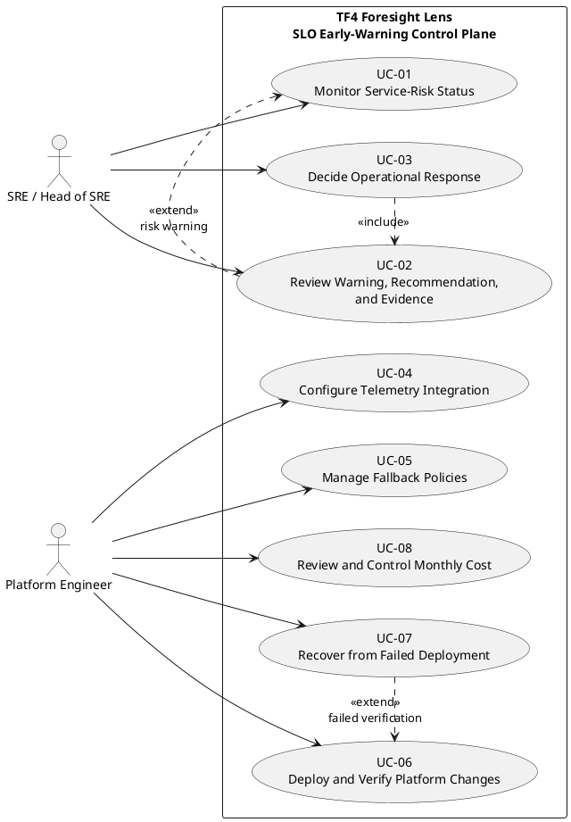

**Figure 2.1. System-level use-case diagram**

The SRE uses the platform as a decision-support system: they monitor risk status, inspect warning evidence, and retain authority over the operational response. The Platform Engineer establishes the telemetry integration and fallback configuration, deploys and verifies changes, restores service after deployment failure, and controls cost. Automated behavior supports these goals but does not constitute an additional actor or remove human control.

### 2.3.2. Detailed Use Case UC-01 — Monitor Service-Risk Status

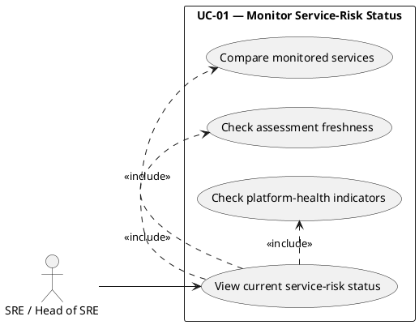

**Figure 2.2. Detailed use case UC-01: Monitor Service-Risk Status**

This diagram decomposes UC-01 into the monitoring actions available to the SRE. A warning may extend this use case by initiating UC-02, but evidence review is not part of the monitoring use case itself.

### 2.3.3. Detailed Use Case UC-02 — Review Warning, Recommendation, and Evidence

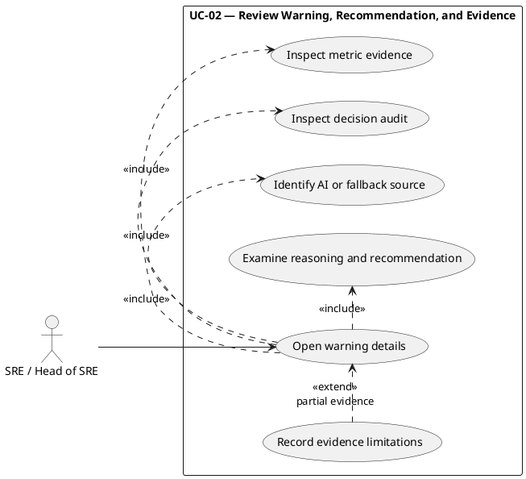

**Figure 2.3. Detailed use case UC-02: Review Warning, Recommendation, and Evidence**

UC-02 starts when the SRE opens a warning or retrieves its audit record. It ends when the available evidence and its limitations are understood. Selecting an operational response is deliberately reserved for UC-03.

### 2.3.4. Detailed Use Case UC-03 — Decide Operational Response

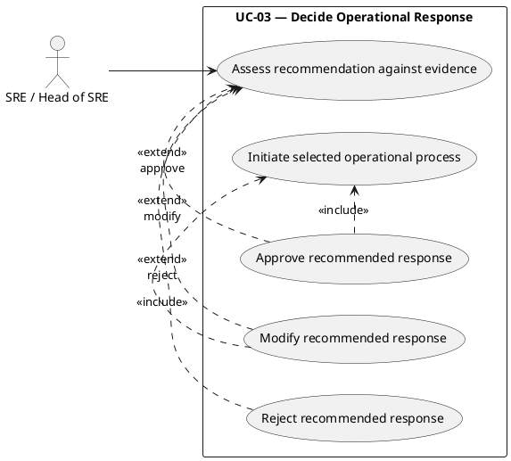

**Figure 2.4. Detailed use case UC-03: Decide Operational Response**

UC-03 follows UC-02 because a response must be based on reviewed evidence. The platform provides decision support only; the SRE remains responsible for approving, modifying, or rejecting the recommendation, and no automatic remediation is performed.

### 2.3.5. Detailed Use Case UC-04 — Configure Telemetry Integration

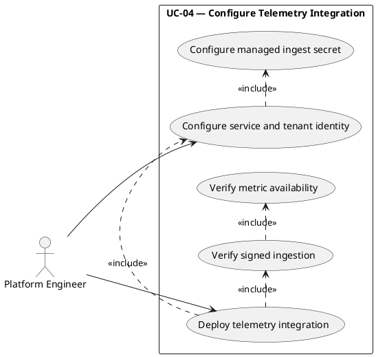

**Figure 2.5. Detailed use case UC-04: Configure Telemetry Integration**

UC-04 covers the Platform Engineer's complete telemetry-integration goal, from establishing controlled identity and configuration to verifying that accepted samples become available for analysis.

### 2.3.6. Detailed Use Case UC-05 — Manage Fallback Policies

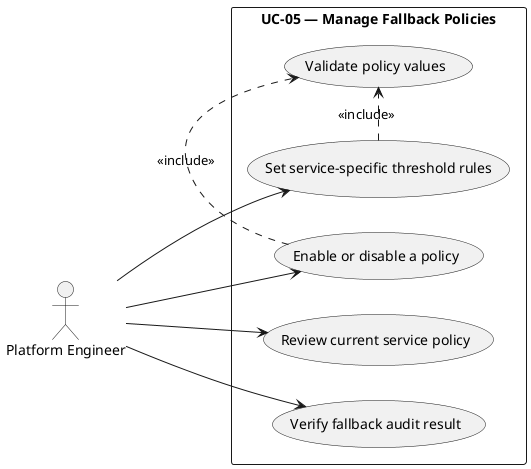

**Figure 2.6. Detailed use case UC-05: Manage Fallback Policies**

UC-05 concerns controlled configuration of service-specific fallback behavior. Runtime fallback evaluation is an internal mechanism; the human goal is to maintain valid policies and verify that their use remains traceable.

### 2.3.7. Detailed Use Case UC-06 — Deploy and Verify Platform Changes

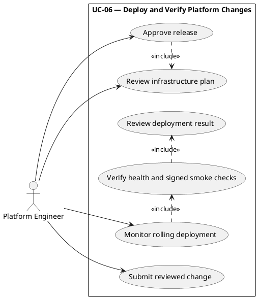

**Figure 2.7. Detailed use case UC-06: Deploy and Verify Platform Changes**

UC-06 ends with either a verified release or a reported verification failure. A failed deployment extends this goal through UC-07 rather than merging deployment and recovery into one use case.

### 2.3.8. Detailed Use Case UC-07 — Recover from Failed Deployment

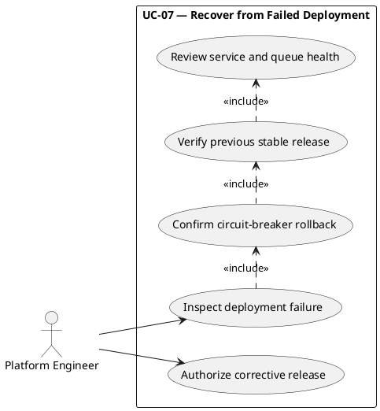

**Figure 2.8. Detailed use case UC-07: Recover from Failed Deployment**

UC-07 is invoked only when UC-06 does not reach a healthy verified state. Automated rollback is supporting behavior; the Platform Engineer verifies restoration, investigates the failure, and controls any corrective release.

### 2.3.9. Detailed Use Case UC-08 — Review and Control Monthly Cost

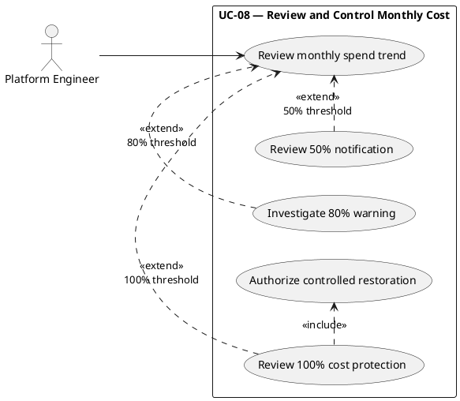

**Figure 2.9. Detailed use case UC-08: Review and Control Monthly Cost**

UC-08 includes routine spend review as well as threshold response. At the hard limit, automated protection stops prediction-processing capacity but leaves telemetry ingestion active; restoration still requires Platform Engineer authorization.

## 2.4. Use-Case Specifications

The specifications follow the eight system-level use cases in the same order. Automated services appear only as internal platform behavior within a flow, not as actors.

**Table 2.6. Use-case traceability matrix**

| System use case | Functional requirements | Detailed diagram | Specification | Activity diagram |
|---|---|---|---|---|
| UC-01 — Monitor Service-Risk Status | FR-06–FR-12, FR-18 | Figure 2.2 | Table 2.7 | Figure 2.10 |
| UC-02 — Review Warning, Recommendation, and Evidence | FR-10–FR-12, FR-18 | Figure 2.3 | Table 2.8 | Figure 2.11 |
| UC-03 — Decide Operational Response | FR-11–FR-12 | Figure 2.4 | Table 2.9 | Figure 2.12 |
| UC-04 — Configure Telemetry Integration | FR-01–FR-05 | Figure 2.5 | Table 2.10 | Figure 2.13 |
| UC-05 — Manage Fallback Policies | FR-09–FR-10 | Figure 2.6 | Table 2.11 | Figure 2.14 |
| UC-06 — Deploy and Verify Platform Changes | FR-13, FR-15, FR-18 | Figure 2.7 | Table 2.12 | Figure 2.15 |
| UC-07 — Recover from Failed Deployment | FR-14, FR-18 | Figure 2.8 | Table 2.13 | Figure 2.16 |
| UC-08 — Review and Control Monthly Cost | FR-16–FR-18 | Figure 2.9 | Table 2.14 | Figure 2.17 |

### 2.4.1. UC-01 — Monitor Service-Risk Status

**Table 2.7. Use-case specification UC-01: Monitor Service-Risk Status**

| Attribute | Description |
|---|---|
| Use case | UC-01 — Monitor Service-Risk Status |
| Primary actor | SRE / Head of SRE |
| Related requirements | FR-06–FR-12 and FR-18 |
| Goal | Observe timely and traceable risk status for each monitored fintech service. |
| Preconditions | The monitored services and prediction policies are configured; telemetry and the required platform components are available. |
| Postconditions | The SRE can see the current assessment, its freshness, and relevant platform-health indicators; a high-risk result is available for UC-02. |
| Main flow | 1. The SRE opens the current operational view or warning channel. 2. The platform presents the latest status for each monitored service. 3. It shows assessment time, source, and evidence availability. 4. The SRE compares the service states and checks freshness and platform-health indicators. 5. The SRE continues routine monitoring when no warning requires investigation. |
| Alternative flows | Missing or stale status is shown as an operational limitation rather than a normal result. A high-risk warning extends the flow to UC-02. Internal query, AI, audit, and notification failures are exposed through health, alarm, retry, or dead-letter evidence. |

### 2.4.2. UC-02 — Review Warning, Recommendation, and Evidence

**Table 2.8. Use-case specification UC-02: Review Warning, Recommendation, and Evidence**

| Attribute | Description |
|---|---|
| Use case | UC-02 — Review Warning, Recommendation, and Evidence |
| Primary actor | SRE / Head of SRE |
| Related requirements | FR-10–FR-12 and FR-18 |
| Goal | Understand a warning, its recommendation, its decision source, and the evidence that supports it. |
| Preconditions | A warning or durable decision-audit record exists. |
| Postconditions | The SRE understands the decision source, severity, reasoning, recommendation, metric evidence, and any evidence limitation. |
| Main flow | 1. The SRE opens the warning. 2. They identify the tenant, service, prediction identifier, severity, and decision source. 3. They inspect the durable audit history. 4. They examine the relevant metric and operational evidence. 5. They review the reasoning and recommendation. 6. They note whether evidence is complete, partial, or produced through fallback. |
| Alternative flows | If notification delivery failed, the SRE retrieves the audit through the operational view. If the source is fallback, they inspect the recorded AI or data failure and threshold evidence. If evidence is partial, they record that limitation and may investigate telemetry or AI availability before proceeding to UC-03. |

### 2.4.3. UC-03 — Decide Operational Response

**Table 2.9. Use-case specification UC-03: Decide Operational Response**

| Attribute | Description |
|---|---|
| Use case | UC-03 — Decide Operational Response |
| Primary actor | SRE / Head of SRE |
| Related requirements | FR-11–FR-12 |
| Goal | Select a responsible operational response after reviewing the available warning evidence. |
| Preconditions | UC-02 has been completed and the SRE understands the recommendation and its limitations. |
| Postconditions | The recommendation is approved, modified, or rejected; any selected operational work remains under human control. |
| Main flow | 1. The SRE compares the recommendation with current metrics, service context, and operational risk. 2. They assess the confidence and evidence limitations. 3. They choose to approve, modify, or reject the recommendation. 4. If action is required, they initiate the appropriate controlled operational process. 5. They continue monitoring the service outcome. |
| Alternative flows | The SRE may defer action and request further investigation when evidence is incomplete or conflicting. A recommendation may be rejected when its operational risk exceeds the expected benefit. The platform never performs the response automatically. |

### 2.4.4. UC-04 — Configure Telemetry Integration

**Table 2.10. Use-case specification UC-04: Configure Telemetry Integration**

| Attribute | Description |
|---|---|
| Use case | UC-04 — Configure Telemetry Integration |
| Primary actor | Platform Engineer |
| Related requirements | FR-01–FR-05 |
| Goal | Establish a secure telemetry path for the monitored services and verify that valid metrics become available for analysis. |
| Preconditions | The platform environment and ingestion route are available; approved service identities, tenant context, and managed ingest configuration have been prepared. |
| Postconditions | Valid telemetry is accepted and represented in the metric store, while invalid or unsafe data is rejected without persistence. |
| Main flow | 1. The Platform Engineer configures the service identity, tenant context, and managed ingest secret. 2. They deploy or update the telemetry integration. 3. The platform authenticates signed ingestion requests. 4. It validates tenant match, timestamp, metric, value, and labels. 5. It updates approved metrics and ingestion counters. 6. The collector securely writes samples to AMP. 7. The engineer verifies accepted responses and metric availability. |
| Alternative flows | Authentication failure returns 403. Invalid tenant context, unsafe labels, unsupported metrics, or missing required labels are rejected. Oversized payload returns 413. If configured delivery fails, accepted data can enter the durable failure buffer; if both delivery and buffering fail, the platform returns 503 for investigation. |

### 2.4.5. UC-05 — Manage Fallback Policies

**Table 2.11. Use-case specification UC-05: Manage Fallback Policies**

| Attribute | Description |
|---|---|
| Use case | UC-05 — Manage Fallback Policies |
| Primary actor | Platform Engineer |
| Related requirements | FR-09–FR-10 |
| Goal | Maintain valid service-specific fallback rules that preserve traceable assessment when AI or usable data is unavailable. |
| Preconditions | The fallback-policy store and approved service identities exist. |
| Postconditions | A validated policy is enabled, disabled, or updated, and later fallback decisions can identify the policy and evidence used. |
| Main flow | 1. The Platform Engineer reviews the current policy for a monitored service. 2. They define or adjust bounded metric thresholds and duration rules. 3. The platform validates metric names, operators, values, and policy structure. 4. The engineer enables or updates the approved policy. 5. They verify a resulting audit record during controlled testing or operational review. |
| Alternative flows | Invalid metric names, operators, threshold values, or malformed rules are rejected. If a metric-based rule cannot be evaluated, the runtime uses the configured default static threshold and records the limitation. Policy changes do not trigger automatic remediation. |

### 2.4.6. UC-06 — Deploy and Verify Platform Changes

**Table 2.12. Use-case specification UC-06: Deploy and Verify Platform Changes**

| Attribute | Description |
|---|---|
| Use case | UC-06 — Deploy and Verify Platform Changes |
| Primary actor | Platform Engineer |
| Related requirements | FR-13, FR-15, and FR-18 |
| Goal | Release an approved platform change and verify that the new state is healthy. |
| Preconditions | Change-review and environment policies allow deployment; temporary cloud-role trust and infrastructure state storage are available. |
| Postconditions | The approved release reaches a healthy steady state and passes verification, or its failure initiates UC-07. |
| Main flow | 1. The Platform Engineer submits a change for review. 2. Automated quality, security, and infrastructure checks run. 3. The engineer reviews the proposed infrastructure change and approves the release. 4. The delivery process builds, scans, and publishes immutable images. 5. It applies the infrastructure change and performs a rolling deployment. 6. Health, steady-state, authentication, ingress, prediction, and queue checks run. 7. The engineer reviews the successful deployment result. |
| Alternative flows | A failed quality gate or missing approval blocks deployment. A failed image scan blocks publication. Failed health, steady-state, or post-deployment verification initiates UC-07. The current process creates a new plan during deployment instead of reusing the reviewed plan artifact; this remains an improvement item. |

### 2.4.7. UC-07 — Recover from Failed Deployment

**Table 2.13. Use-case specification UC-07: Recover from Failed Deployment**

| Attribute | Description |
|---|---|
| Use case | UC-07 — Recover from Failed Deployment |
| Primary actor | Platform Engineer |
| Related requirements | FR-14 and FR-18 |
| Goal | Restore the previous stable service state and confirm recovery after UC-06 fails. |
| Preconditions | Deployment health or verification has failed and the previous stable task definition is available. |
| Postconditions | The previous stable release is restored and verified, while the deployment failure remains available for investigation. |
| Main flow | 1. The delivery platform reports the failed deployment or smoke check. 2. The circuit breaker restores the previous stable task definition. 3. The Platform Engineer inspects the failure and rollback status. 4. They verify task health, service reachability, queue behavior, and relevant alarms. 5. They confirm the stable state and investigate the cause. 6. Any corrective release must re-enter UC-06 through normal review. |
| Alternative flows | If automatic rollback cannot restore health, the engineer follows the recovery procedure and may retain affected processing for investigation. No corrective deployment bypasses review or verification. |

### 2.4.8. UC-08 — Review and Control Monthly Cost

**Table 2.14. Use-case specification UC-08: Review and Control Monthly Cost**

| Attribute | Description |
|---|---|
| Use case | UC-08 — Review and Control Monthly Cost |
| Primary actor | Platform Engineer |
| Related requirements | FR-16–FR-18 |
| Goal | Keep the internship environment within the USD 200 monthly budget while preserving telemetry ingestion and controlled restoration. |
| Preconditions | Budget thresholds, notification channels, emergency cost protection, and target workloads are configured. |
| Postconditions | Spend has been reviewed; at 100%, AI and prediction-processing capacity are stopped while ingestion remains active until approved restoration. |
| Main flow | 1. The Platform Engineer reviews the monthly spend trend. 2. At 50%, they acknowledge the informational notification. 3. At 80%, they review synthetic load, logging, query scope, and metric cardinality. 4. At 100%, the platform applies bounded emergency protection by stopping AI and prediction-processing capacity while retaining ingestion. 5. The engineer investigates the cost source. 6. They authorize restoration only after the condition has been addressed. |
| Alternative flows | In dry-run mode, the platform records intended actions without changing capacity. Configuration or per-service update failures are reported for operational review. Audit, policy, and fallback data are retained. |

## 2.5. Activity Diagrams

The following activity diagrams preserve the one-to-one use-case hierarchy. Each diagram models one specification; when another goal is needed, the flow explicitly transfers to the corresponding use case rather than silently combining them.

### 2.5.1. Activity Diagram for UC-01 — Monitor Service-Risk Status

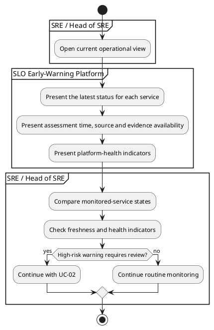

**Figure 2.10. Activity diagram for UC-01: Monitor Service-Risk Status**

### 2.5.2. Activity Diagram for UC-02 — Review Warning, Recommendation, and Evidence

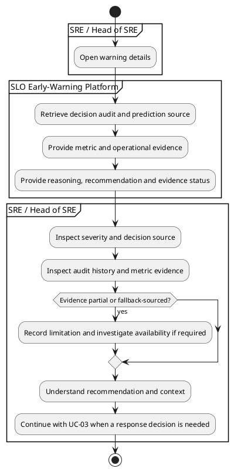

**Figure 2.11. Activity diagram for UC-02: Review Warning, Recommendation, and Evidence**

### 2.5.3. Activity Diagram for UC-03 — Decide Operational Response

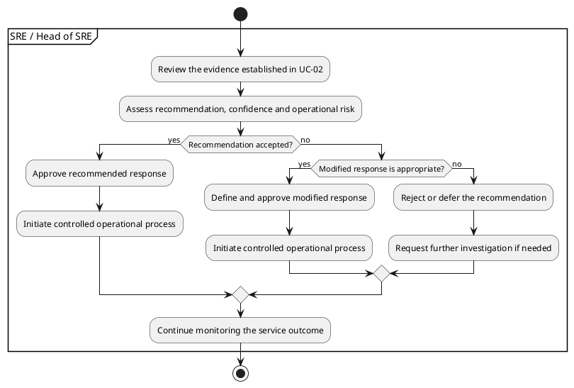

**Figure 2.12. Activity diagram for UC-03: Decide Operational Response**

### 2.5.4. Activity Diagram for UC-04 — Configure Telemetry Integration

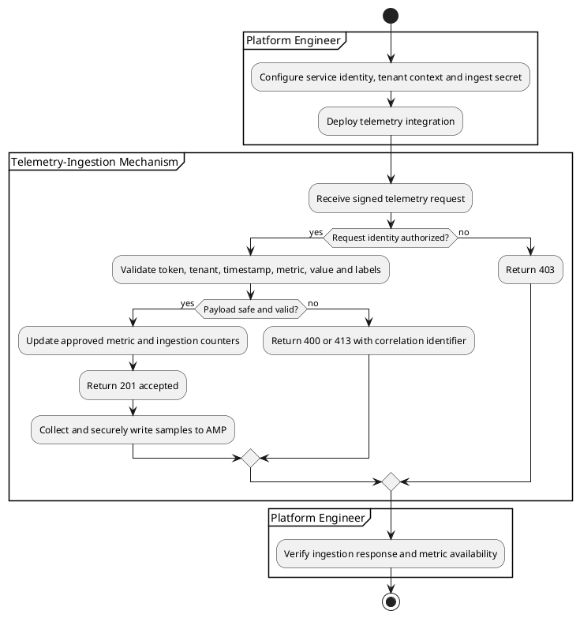

**Figure 2.13. Activity diagram for UC-04: Configure Telemetry Integration**

### 2.5.5. Activity Diagram for UC-05 — Manage Fallback Policies

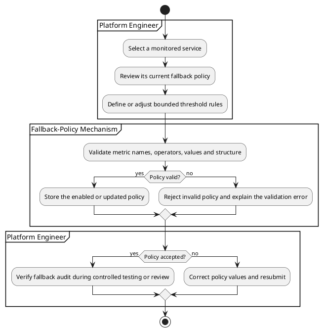

**Figure 2.14. Activity diagram for UC-05: Manage Fallback Policies**

### 2.5.6. Activity Diagram for UC-06 — Deploy and Verify Platform Changes

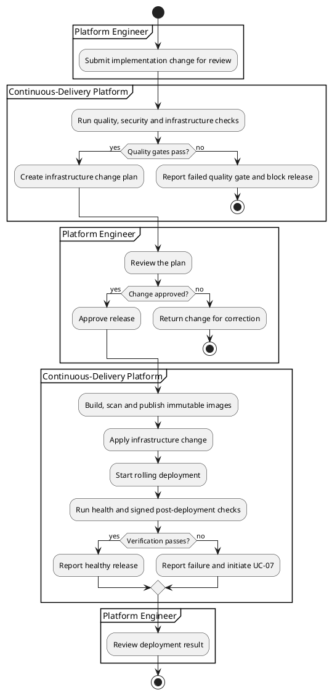

**Figure 2.15. Activity diagram for UC-06: Deploy and Verify Platform Changes**

### 2.5.7. Activity Diagram for UC-07 — Recover from Failed Deployment

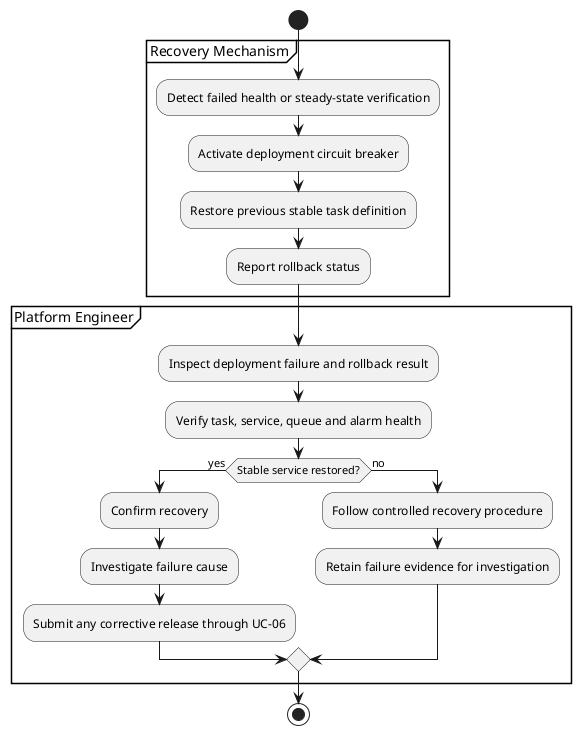

**Figure 2.16. Activity diagram for UC-07: Recover from Failed Deployment**

### 2.5.8. Activity Diagram for UC-08 — Review and Control Monthly Cost

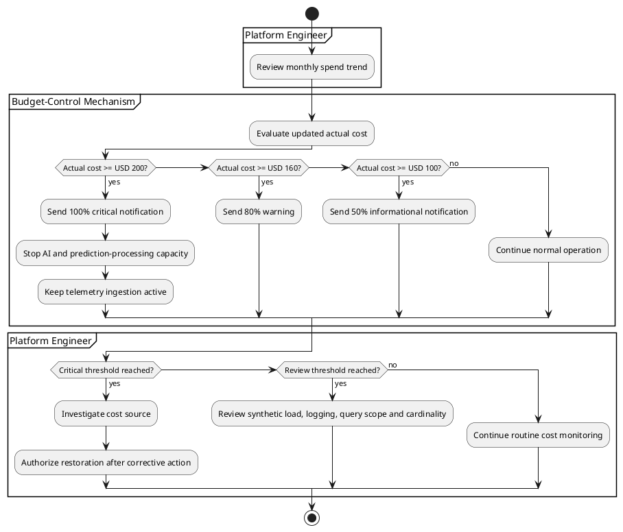

**Figure 2.17. Activity diagram for UC-08: Review and Control Monthly Cost**

## 2.6. Sequence Diagrams

Unlike the use-case diagrams, sequence diagrams show interaction participants. A participant may therefore be a human role, application component, or managed service; this does not make every participant a system actor. These diagrams provide interaction-level detail for the identified parent use cases: telemetry ingestion supports UC-04, prediction and evidence delivery support UC-01 and UC-02, and the delivery sequence supports UC-06 and UC-07.

### 2.6.1. Telemetry-Ingestion Sequence Diagram

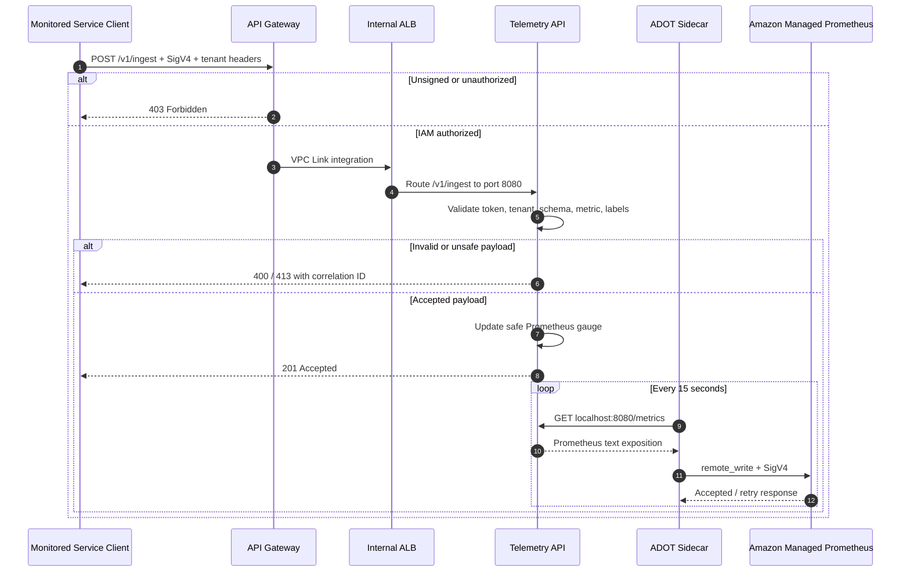

**Figure 2.18. Telemetry-ingestion sequence diagram supporting UC-04**

### 2.6.2. Prediction, Audit, and Alert Sequence Diagram

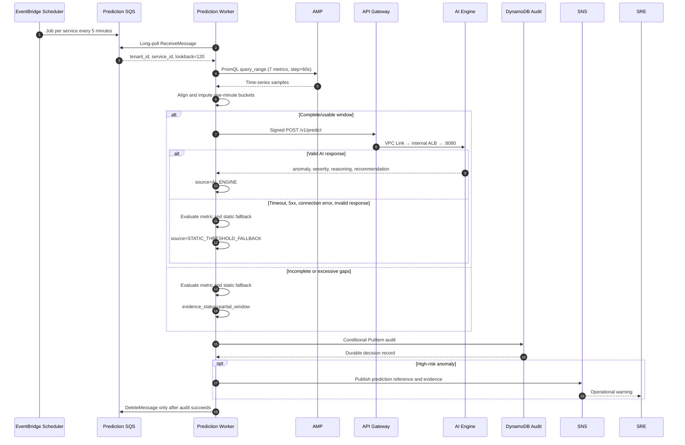

**Figure 2.19. Prediction, audit, and alert sequence diagram supporting UC-01 and UC-02**

### 2.6.3. CI/CD Deployment Sequence Diagram

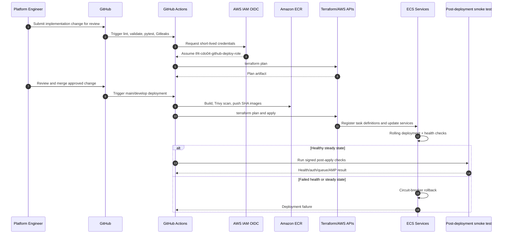

**Figure 2.20. CI/CD deployment sequence diagram supporting UC-06 and UC-07**

## 2.7. State Diagrams

State diagrams describe the lifecycle of internal mechanisms that support the parent use cases. They do not introduce additional actors or independent use cases.

### 2.7.1. Prediction-Job State Diagram

```plantuml
@startuml
skinparam shadowing false
[*] --> Scheduled
Scheduled --> Queued : SendMessage
Queued --> Processing : Worker receives
Processing --> QueryingAMP
QueryingAMP --> WindowReady : 120-minute usable window
QueryingAMP --> FallbackEvaluation : query failure / insufficient data
WindowReady --> CallingAI
CallingAI --> AIValidated : 200 + valid contract
CallingAI --> FallbackEvaluation : timeout / 5xx / invalid
AIValidated --> AuditPending : source=AI_ENGINE
FallbackEvaluation --> AuditPending : source=STATIC_THRESHOLD_FALLBACK
AuditPending --> Audited : conditional PutItem succeeds
AuditPending --> Retryable : audit write fails
Retryable --> Queued : visibility timeout / retry
Retryable --> DeadLettered : receive count >= 5
Audited --> Alerted : high-risk anomaly
Audited --> Completed : no high-risk alert
Alerted --> Completed
DeadLettered --> [*]
Completed --> [*]
@enduml
```

**Figure 2.21. Prediction-job state diagram supporting UC-01**

The job is not considered complete when AI returns. Durable audit persistence is the success boundary. This ensures that an alert is not produced without a traceable decision record.

### 2.7.2. Deployment and Recovery State Diagram

```plantuml
@startuml
skinparam shadowing false
[*] --> Planned
Planned --> Blocked : quality gate / approval failure
Blocked --> Planned : corrected change resubmitted
Planned --> Deploying : approved release
Deploying --> Verifying : tasks healthy and steady
Deploying --> RollingBack : health or steady-state failure
Verifying --> Steady : signed checks pass
Verifying --> RollingBack : signed checks fail
RollingBack --> RecoveryVerification : previous task definition restored
RecoveryVerification --> Steady : service and queue health confirmed
RecoveryVerification --> RecoveryRequired : stable state not restored
RecoveryRequired --> Planned : corrective change reviewed under UC-06
Steady --> Deploying : next approved release
Steady --> [*] : operation continues
@enduml
```

**Figure 2.22. Deployment and recovery state diagram supporting UC-06 and UC-07**

This state model is limited to deployment and recovery. Monthly cost control remains modeled separately by UC-08 and Figure 2.17, so the state diagram does not combine unrelated use-case parents.

## 2.8. Domain Class Diagram

```mermaid
classDiagram
    class TelemetryPayload {
      +datetime ts
      +string tenant_id
      +string service_id
      +string metric_type
      +number value
      +map labels
    }
    class TelemetryRecord {
      +string event_id
      +string idempotency_key
      +string correlation_id
      +string status
    }
    class PredictionJob {
      +string correlation_id
      +string prediction_id
      +string tenant_id
      +string service_id
      +int lookback_window_minutes
    }
    class SignalDatapoint {
      +datetime ts
      +string tenant_id
      +string service_id
      +string metric_type
      +number value
      +map labels
    }
    class PredictRequest {
      +SignalDatapoint[] signal_window
      +PredictContext context
    }
    class PredictResponse {
      +bool anomaly
      +number severity
      +string reasoning
      +string audit_id
    }
    class Recommendation {
      +string action_verb
      +string target
      +string from_to
      +number confidence
      +string evidence_link
    }
    class ServicePolicy {
      +string tenant_id
      +string service_name
      +number static_threshold
      +bool enabled
      +FallbackRule[] rules
    }
    class FallbackRule {
      +string metric_type
      +string operator
      +number threshold
      +int duration_minutes
      +string aggregate
      +string risk_level
    }
    class AuditRecord {
      +string prediction_id
      +string prediction_source
      +string prediction_status
      +string evidence_status
      +number ai_status_code
      +number ai_latency_ms
      +datetime expires_at_epoch
    }

    TelemetryPayload --> TelemetryRecord : creates
    PredictionJob --> PredictRequest : builds
    PredictRequest *-- SignalDatapoint
    PredictResponse *-- Recommendation
    ServicePolicy *-- FallbackRule
    PredictResponse --> AuditRecord : persisted as
    ServicePolicy --> AuditRecord : fallback source
```

**Figure 2.23. Domain class diagram**

**Table 2.15. Principal domain entities**

| Entity | Responsibility |
|---|---|
| `TelemetryPayload` | External telemetry contract validated at the system boundary. |
| `TelemetryRecord` | Internal accepted event with correlation and idempotency identifiers. |
| `PredictionJob` | Scheduled instruction identifying tenant, service, and lookback. |
| `SignalDatapoint` | One timestamped metric value in the AI signal window. |
| `PredictRequest` | AI request containing at least 120 datapoints and deployment/time context. |
| `PredictResponse` | AI anomaly result with severity, reasoning, recommendation, and audit ID. |
| `ServicePolicy` | Tenant/service fallback configuration stored in DynamoDB. |
| `AuditRecord` | Durable record of AI or fallback source, decision, evidence, and TTL. |

## 2.9. Logical Component Diagram

This diagram distinguishes the human roles from external technical inputs and internal platform components. Its technical nodes describe architecture, not additional actors.

```mermaid
flowchart LR
    subgraph Human[Human Interaction]
        SRE[SRE / Head of SRE]
        Engineer[Platform Engineer]
    end

    subgraph External[External Technical Inputs]
        Producers[Monitored services / load generator]
        Delivery[Continuous-delivery platform]
    end

    subgraph Entry[Public AWS Entry Boundary]
        APIGW[API Gateway HTTP API\nAWS_IAM / SigV4]
    end

    subgraph VPC[Private VPC Workloads]
        ALB[Internal ALB]
        Telemetry[Telemetry API\nECS Fargate]
        ADOT[ADOT Sidecar]
        Worker[Prediction Worker\nECS Fargate]
        AI[AI Engine\nECS Fargate]
    end

    subgraph Managed[AWS Managed Data and Operations]
        AMP[Amazon Managed\nService for Prometheus]
        Scheduler[EventBridge Scheduler]
        Queue[SQS + Worker DLQ\n+ Scheduler DLQ]
        DDB[DynamoDB\nAudit + Policies]
        S3[S3\nBaselines + Evidence]
        CW[CloudWatch\nLogs + Dashboard + Alarms]
        SNS[SNS Alerts]
        Budget[AWS Budget\n+ Cost Breaker]
    end

    Producers -->|Signed ingest| APIGW
    APIGW -->|VPC Link| ALB
    ALB --> Telemetry
    ALB --> AI
    Telemetry --> ADOT
    ADOT -->|remote_write| AMP
    Scheduler --> Queue
    Queue --> Worker
    Worker -->|query_range| AMP
    Worker -->|Signed predict via API Gateway| APIGW
    AI --> S3
    Worker --> DDB
    Worker --> SNS
    Telemetry --> CW
    Worker --> CW
    AI --> CW
    SNS --> SRE
    CW --> SRE
    Engineer -->|Configure and approve changes| Delivery
    Delivery -->|OIDC + Terraform/ECR| VPC
    Budget -->|Budget notifications| Engineer
    Budget -->|100%: bounded cost protection| VPC
```

**Figure 2.24. Logical component diagram**

## 2.10. AWS Deployment Diagram

```mermaid
flowchart TB
    ExternalAccess[Monitored-service traffic / delivery access / SRE access]

    subgraph AWS[AWS Account — us-east-1]
        APIGW[API Gateway HTTP API]
        ECR[ECR repositories]
        OIDC[IAM OIDC Provider and Deploy Role]

        subgraph VPC[VPC]
            IGW[Internet Gateway]
            NAT[One NAT Gateway\nPublic subnet]
            VPCL[VPC Link]
            ALB[Internal ALB\nPrivate subnets]

            subgraph ECS[ECS Fargate Cluster — private subnets]
                TTask[Telemetry task\nTelemetry API + ADOT]
                WTask[Prediction Worker task]
                AITask1[AI Engine task 1]
                AITask2[AI Engine task 2]
            end

            S3EP[S3 Gateway Endpoint]
            DDBEP[DynamoDB Gateway Endpoint]
        end

        AMP[AMP Workspace]
        DDB[DynamoDB Audit and Policy]
        SQS[SQS Prediction + DLQs]
        S3[S3 Evidence and Baselines]
        EB[EventBridge Scheduler]
        CW[CloudWatch]
        SNS[SNS]
        Secrets[Secrets Manager / SSM / KMS]
        Budget[AWS Budget / Lambda Cost Breaker]
    end

    ExternalAccess --> APIGW
    ExternalAccess --> OIDC
    OIDC --> ECR
    OIDC --> ECS
    APIGW --> VPCL --> ALB
    ALB --> TTask
    ALB --> AITask1
    ALB --> AITask2
    TTask --> AMP
    EB --> SQS --> WTask
    WTask --> AMP
    WTask --> NAT --> APIGW
    WTask --> DDBEP --> DDB
    AITask1 --> S3EP --> S3
    AITask2 --> S3EP
    ECS --> CW --> SNS
    Secrets --> ECS
    Budget --> ECS
```

**Figure 2.25. AWS deployment diagram**

**Table 2.16. Main AWS components**

| Component | Role |
|---|---|
| API Gateway HTTP API | Public front door and SigV4 enforcement for ingest and predict routes. |
| VPC Link and internal ALB | Private routing to Telemetry API and AI Engine target groups. |
| ECS Fargate | Hosts Telemetry API, Prediction Worker, and AI Engine without EC2 management. |
| ECR | Stores immutable, scan-on-push container images. |
| AMP | Stores Prometheus-compatible metric evidence and serves PromQL queries. |
| EventBridge Scheduler | Creates prediction jobs every five minutes. |
| SQS and DLQs | Decouple scheduling from processing and preserve repeated failures. |
| DynamoDB | Stores prediction audits and service fallback policies. |
| S3 | Stores AI baselines, evidence exports, and failure-buffer data. |
| CloudWatch | Provides logs, dashboards, metrics, alarms, and operational evidence. |
| SNS | Delivers high-risk and operational notifications. |
| IAM, KMS, Secrets Manager, SSM | Provide identity, least privilege, encryption, and managed configuration. |
| AWS Budgets and Lambda | Enforce warning thresholds and bounded emergency cost protection. |

## 2.11. Key Architecture Decisions

### 2.11.1. ECS Fargate Instead of Lambda or EKS

ECS Fargate was selected because the client context used ECS and the project needed three container workloads with independent lifecycle, IAM roles, health checks, scaling, logging, and rollback. Lambda could reduce low-volume cost, but worker queries and AI calls introduce execution and cold-start considerations and do not match the desired container operations evidence. EKS would introduce unnecessary cluster, ingress, RBAC, and operational overhead for the capstone scope.

### 2.11.2. AMP Instead of Timestream for InfluxDB

An earlier InfluxDB option was superseded after cost analysis showed that a fixed `db.influx.medium` instance could push the monthly architecture above USD 200. AMP uses Prometheus labels, PromQL, IAM/SigV4, managed retention, and usage-based pricing. At the demo volume, its estimated cost is negligible. ADOT was selected for remote write because implementing Prometheus protobuf, Snappy compression, SigV4, batching, and retry directly in the Python API would add unnecessary protocol complexity.

### 2.11.3. EventBridge Scheduler, SQS, and a Worker

The queue separates job creation from processing. AI latency or temporary unavailability does not block the scheduler. SQS also supplies backlog visibility, retry behavior, DLQ isolation, and a scaling signal for the worker. A direct scheduler-to-AI call would bypass window construction, contract validation, fallback, and durable audit.

### 2.11.4. DynamoDB for Decision Audit

Audit records are append-heavy and accessed by tenant, service, time, prediction state, or prediction ID. DynamoDB provides on-demand capacity, server-side encryption, TTL, conditional writes, and point-in-time recovery without relational database administration. S3 remains appropriate for archive/evidence objects but is less convenient for near-real-time decision lookup.

### 2.11.5. API Gateway and an Internal ALB

An ALB cannot enforce AWS_IAM/SigV4 by itself. API Gateway therefore serves as the public authentication boundary. VPC Link forwards authorized requests to the internal ALB, which routes to private ECS tasks. The worker reaches the public execute-api endpoint through the existing NAT Gateway and invokes AI through the same protected route. The additional request and NAT-data cost is approximately USD 0.17/month at demo cadence.

### 2.11.6. One NAT Gateway with S3 and DynamoDB Gateway Endpoints

One NAT Gateway costs approximately USD 33.39/month under the accepted 12 GB model. A full set of interface endpoints across two Availability Zones would cost approximately USD 146/month before meaningful traffic, making it unsuitable for the current low-volume budget. Free S3 and DynamoDB Gateway Endpoints reduce NAT use for those services. Additional interface endpoints remain a production-hardening option.

### 2.11.7. Fail-Open Static Fallback

If the platform failed closed whenever AI was unavailable, the entire early-warning capability would disappear during a dependency failure. Static fallback provides less sophisticated decisions but preserves monitoring and audit. It is a safety path, not a replacement for restoring AI or data quality. It never automatically changes the monitored service.

<!-- PAGE BREAK -->

# CHAPTER 3: IMPLEMENTATION AND RESULTS

## 3.1. Implementation Structure and Components

The implementation was organized into related functional areas so that requirements, infrastructure, application services, testing, deployment, and evaluation could be developed and reviewed consistently.

**Table 3.1. Project implementation structure**

| Component or area | Responsibility |
|---|---|
| Interface specifications | Define the telemetry, prediction, and deployment expectations shared among system components. |
| Technical documentation | Record requirements, architecture, security, deployment, cost, design decisions, and evaluation results. |
| Infrastructure foundation | Establish remote state management and temporary AWS access for automated deployment. |
| Terraform infrastructure | Define reusable networking, data, compute, and observability resources. |
| Telemetry API | Validate telemetry, enforce safe dimensions, export Prometheus metrics, and support failure buffering. |
| Prediction Worker | Query metric windows, prepare input data, invoke prediction or fallback logic, and persist decisions. |
| AI Engine | Provide the hosted prediction interface, baseline loading, decision responses, and audit integration. |
| Cost-control function | Apply the bounded emergency action associated with the monthly budget limit. |
| Operational visibility tool | Provide local, read-only access to selected operational evidence. |
| Automated test suites | Verify unit behavior, interfaces, security controls, end-to-end flows, and load characteristics. |
| Deployment-support checks | Verify health, authentication, routing, queues, metrics, and workload stability after deployment. |
| Evaluation evidence | Preserve curated test outputs and runtime observations used in the report. |

```mermaid
flowchart LR
    Requirements[Requirements and interface specifications] --> Applications[Application components]
    Requirements --> Infrastructure[Infrastructure configuration]
    Documentation[Technical documentation] --> Infrastructure
    Infrastructure --> AWS[AWS environment]
    Applications --> Tests[Automated tests]
    Infrastructure --> Tests
    Delivery[Continuous-delivery process] --> Infrastructure
    Delivery --> Tests
    Tests --> Evidence[Evaluation evidence]
    Checks[Post-deployment checks] --> Evidence
```

**Figure 3.1. Implementation structure and component relationships**

## 3.2. Telemetry API Implementation

The Telemetry API was implemented as a modular FastAPI service. Its design separates request handling, data schemas, validation, middleware, service logic, integration adapters, and observability responsibilities.

The primary endpoints are:

- `GET /health`
- `POST /v1/ingest`
- `GET /metrics` for private ADOT scraping
- `GET /debug/metrics-json` for controlled local diagnostics

The ingestion route requires `X-Tenant-Id`. In production, API Gateway requires SigV4 and the application also validates `X-Tenant-Ingest-Token`. A bearer token remains a local/internal fallback only. Middleware creates or preserves `X-Correlation-Id` and rejects oversized bodies before JSON processing.

The telemetry schema requires `ts`, `tenant_id`, `service_id`, `metric_type`, `value`, and `labels`. The timestamp must be RFC3339 UTC; values must be finite; identifiers must be non-empty strings; labels must be flat, bounded, and safe. The validator rejects PII and high-cardinality fields, unsupported metrics, internal-only metrics, missing required labels, empty labels, and tenant mismatch.

Accepted telemetry receives an event ID and a deterministic SHA-256 idempotency key. The Prometheus exporter publishes only the seven approved metric names and safe labels. In the deployed architecture, an ADOT Collector sidecar scrapes `localhost:8080/metrics` every 15 seconds and remote-writes to the AMP workspace using the task role and SigV4. This architecture replaced an incomplete direct remote-write path that lacked the full Prometheus wire protocol and SigV4 behavior.

The API reports accepted and buffered outcomes. Invalid or unsafe data is never written to the failure buffer. When the configured delivery adapter cannot write to AMP after bounded retries, the payload can be saved to the S3 `failure-buffer/` prefix with its idempotency key. If both the delivery and durable buffer fail, the API returns 503.

## 3.3. Prediction Worker Implementation

The Prediction Worker was implemented as a continuously running service that long-polls the prediction SQS queue. Each job identifies the tenant and monitored service, may include correlation and prediction identifiers, and uses the required 120-minute lookback period.

For each job, the worker:

1. Validates the job and service policy.
2. Queries all seven AMP metrics with tenant and service scoping.
3. Aligns the result to one-minute timestamps.
4. Forward-fills CPU, memory, active connections, database pool, cache hit rate, and API latency.
5. Zero-fills queue depth because no queued item at a missing sample is treated differently from an unknown gauge.
6. Computes the missing-data ratio and skips AI when gaps reach 50%.
7. Uses dynamic task credentials to sign the AI request through API Gateway.
8. Validates the AI response and maps it to a decision.
9. Evaluates service-specific metric fallback rules on AI or data failure.
10. Reads a DynamoDB static threshold when no usable metric rule exists.
11. Writes a conditional audit record with a 90-day TTL.
12. Publishes a high-risk SNS warning.
13. Deletes the SQS message only after successful audit persistence.

The implemented decision values include `KEEP_ALIVE`, `SCALE_UP`, `SCALE_DOWN`, `RETIRE`, `ROLLBACK`, `INVESTIGATE`, and `UNKNOWN`. Prediction sources are `AI_ENGINE` and `STATIC_THRESHOLD_FALLBACK`; status is `complete` or `fallback`; evidence status is `complete_window` or `partial_window`.

A significant implementation improvement was replacing a hard-coded fallback tenant and threshold behavior with tenant-aware service policies derived from real metric values. This made the fallback path consistent with the same evidence used for AI processing.

## 3.4. AI Engine Hosting and Integration

The AI Engine was hosted as a FastAPI service. Its deployed endpoints are `GET /health` and `POST /v1/predict`. The request contains a `signal_window` and deployment/time context. It requires at least 120 datapoints and limits the maximum request size to 10,000 datapoints. Tenant IDs in all datapoints must match the `X-Tenant-Id` header, and gaps larger than 65 seconds are rejected.

The response includes `anomaly`, `severity`, `reasoning`, `recommendation`, and `audit_id`. Allowed recommendation actions are `SCALE_UP`, `SCALE_DOWN`, `RETIRE`, `ROLLBACK`, and `INVESTIGATE`. The service loads versioned baseline data locally or from S3 and can store an AI-level audit locally or in S3/KMS.

In this internship report, these details describe the workload contract and the infrastructure required to host it. The student's work concerned deployment, routing, authentication, baseline delivery, health, scaling, logs, and integration. The report does not claim ownership of AI model training or quality optimization.

## 3.5. Local SRE Visibility Tool

A local-only SRE dashboard was implemented to provide read-only views of tenants, services, AMP metrics, DynamoDB audits, CloudWatch alarms, SQS attributes, and ECS services, together with controlled updates to fallback-policy values. It uses AWS SSO profiles and never returns credentials to the user interface. Queue inspection reads attributes without retrieving messages, so viewing the dashboard cannot consume a prediction job.

This tool supports demonstration and operational evaluation. It does not change the project's central scope into a new production dashboard product. CloudWatch, AMP, DynamoDB, and validated runtime evidence remain the authoritative data sources.

## 3.6. Terraform Infrastructure

Terraform v1.10 or later is used. Remote state is stored in an encrypted, versioned S3 bucket with public access blocked and a TLS-only policy. Native S3 state locking is used instead of a separate DynamoDB lock table. Independent remote-state objects are maintained for the sandbox, staging, and production environments.

The main infrastructure configuration composes four functional modules.

**Table 3.2. Terraform modules and responsibilities**

| Module | Principal resources |
|---|---|
| `networking` | VPC, public/private subnets, Internet Gateway, one NAT Gateway, routes, S3/DynamoDB Gateway Endpoints, and Security Groups. |
| `data` | AMP workspace, DynamoDB audit/policy tables, prediction queue/DLQ, scheduler DLQ, S3 evidence bucket, baselines, EventBridge schedules, KMS, SSM, and Secrets Manager. |
| `compute` | ECS cluster, ECR repositories, task/execution roles, three task definitions/services, Service Connect namespace, API Gateway, VPC Link, internal ALB, log groups, and autoscaling. |
| `observability` | CloudWatch dashboard and alarms, SNS topics/subscriptions, AWS Budget, Cost Breaker Lambda, failure DLQ, and cost dashboard. |

```mermaid
flowchart TD
    Bootstrap[Bootstrap configuration\nS3 state + OIDC] --> Root[Terraform root configuration]
    Root --> Network[networking module]
    Root --> Data[data module]
    Root --> Compute[compute module]
    Root --> Obs[observability module]
    Network --> Compute
    Data --> Compute
    Network --> Data
    Compute --> Obs
    Data --> Obs
```

**Figure 3.2. Terraform module dependency structure**

### 3.6.1. Implemented AWS Architecture

The following implementation figures were prepared with AWS service icons during infrastructure design and updated as the deployment architecture evolved. Together, they show the AWS account boundary, regional and VPC organization, private compute layer, managed-service integrations, data stores, and observability path. They complement the logical diagrams in Chapter 2 by presenting the concrete service groups used during implementation.

<div align="center">


**Figure 3.3. Overall AWS implementation layout**

</div>

The overall layout places API Gateway at the external AWS boundary and forwards authorized requests through VPC Link to the internal ALB. ECS Fargate workloads run in private subnets, while S3 and DynamoDB use VPC endpoints. AMP, SQS/DLQ, Secrets Manager, ECR, CloudWatch, and SNS remain AWS managed services outside the ECS compute boundary. The source figure contains earlier shorthand service labels (`payment-gateway`, `ledger-service`, and `kyc-worker`); the final canonical identifiers used by Terraform, tests, and evidence are `payment-gw`, `ledger`, and `fraud-detector`.

> **Implementation note:** This is a high-level infrastructure-design figure. The final infrastructure configuration and validated runtime evidence are authoritative where the figure omits later details such as the ADOT sidecar, Worker-to-AI SigV4 path, or exact Security Group rules.

### 3.6.2. Networking and API Entry

The VPC includes public and private subnets across available Availability Zones. A single NAT Gateway resides in a public subnet; ECS tasks receive no public IP. S3 and DynamoDB use Gateway Endpoints. The public entry point is API Gateway, while the ALB remains internal.

Security Groups separate the VPC Link, ALB, Telemetry API, Prediction Worker, and AI Engine. The VPC Link can reach the ALB listener. The ALB can reach Telemetry API and AI Engine on port 8080. The worker needs no inbound rule and uses outbound HTTPS for AWS APIs and the API Gateway path. The AI Engine accepts traffic from the internal ALB and the documented worker migration path.

<div align="center">


**Figure 3.4. API-entry implementation block**

</div>

The API-entry block illustrates the request handoff toward the compute layer and the optional ACM certificate association considered for HTTPS. In the final implementation, API Gateway is the public entry and SigV4 enforcement point; VPC Link forwards authorized `/v1/ingest` and `/v1/predict` traffic to the internal ALB. The figure's direct `POST v1/ingest` arrow should therefore be interpreted as the logical ingress path rather than a public ALB endpoint.

### 3.6.3. Compute Layer and Managed-Service Integration

ECR repositories are created for `telemetry_api`, `prediction_worker`, and `ai_engine`. Image tags are immutable, images are scanned on push, and lifecycle policies remove old images.

API Gateway defines:

- `GET /health` with authorization `NONE`.
- `POST /v1/ingest` with authorization `AWS_IAM`.
- `POST /v1/predict` with authorization `AWS_IAM`.

The VPC Link integrates with the internal ALB. Listener rules route `/health` and `/v1/ingest` to Telemetry API and `/v1/predict` to AI Engine. ALB target groups use IP targets and health path `/health`, interval 30 seconds, timeout 5 seconds, healthy threshold 2, and unhealthy threshold 3.

All ECS services use deployment circuit breakers with automatic rollback. Telemetry API includes the ADOT sidecar in the same task. The worker and AI Engine have separate task roles and log groups.

<div align="center">


**Figure 3.5. Compute layer and AWS managed services**

</div>

The compute figure shows the three ECS workloads and their principal integrations: ECR image pulls, managed secrets, ADOT remote write to AMP, Scheduler-to-SQS job creation, worker AMP queries, the signed prediction path, AI baseline access, audit persistence, CloudWatch logs, and SNS alerts. It also shows autoscaling as an ECS service-level concern. The final implementation uses an ADOT sidecar in the Telemetry API task and routes Worker-to-AI communication through API Gateway, VPC Link, and the internal ALB.

### 3.6.4. Data Services

The data module creates the AMP workspace, two DynamoDB tables, the prediction queue and processing DLQ, a separate Scheduler target DLQ, the S3 bucket for evidence and baselines, one schedule per service, a project KMS key, SSM parameters, and Secrets Manager resources.

The prediction queue retains messages for four days, uses a 180-second visibility timeout and a 20-second long poll, and moves a message after five failed receives. DLQs retain messages for 14 days. The audit table uses on-demand billing, encryption, point-in-time recovery, and `expires_at_epoch` TTL. Policy seeds exist for `payment-gw`, `ledger`, and `fraud-detector`, but seed lifecycle was later decoupled so operational policy updates would not be overwritten by routine Terraform applies.

The S3 bucket enables versioning, server-side encryption, public-access blocking, and a secure-transport policy. Failure-buffer objects expire after seven days; other evidence and baselines expire after the configured retention period, typically 90 days.

<div align="center">


**Figure 3.6. Data-layer implementation block**

</div>

The data-layer figure focuses on DynamoDB audit/policy access and S3 baseline retrieval. Its heading still includes Amazon Timestream from an earlier design stage. That component was superseded by AMP under ADR-011 and is not part of the final Terraform deployment. In the implemented architecture, AMP is the time-series metric store, DynamoDB holds audit and policy records, and S3 stores baselines, evidence, and failure-buffer objects.

### 3.6.5. Runtime and Autoscaling

**Table 3.3. ECS runtime and scaling configuration**

| Workload | Baseline size | Capacity | Main scaling/health signals |
|---|---|---:|---|
| Telemetry API + ADOT | 1 vCPU, 2 GB | Min 1, max 1 | CPU target 70%, memory target 75%; pinned single-writer MVP |
| Prediction Worker | 0.5 vCPU, 1 GB | Min 1, max 5 | Queue age >120 seconds, visible messages >20, idle scale-in |
| AI Engine | 0.5 vCPU, 1 GB per task | Min 2, max 4 | CPU target 70%, p95 >350 ms, p99 >500 ms, running tasks <2 |

The single Telemetry API task is an explicit MVP consistency trade-off rather than a high-availability claim. The worker can scale with backlog, and the AI Engine maintains two baseline tasks. Health checks and ALB state support the ECS circuit breaker.

## 3.7. Security Implementation

**Table 3.4. Security controls implemented**

| Control area | Implementation |
|---|---|
| Public ingress | API Gateway is the only public application entry point; the ALB and ECS tasks are private. |
| Request authentication | `AWS_IAM`/SigV4 for ingest and prediction routes; unsigned calls receive 403. |
| Tenant context | `X-Tenant-Id`, body/header match, bounded AMP labels, and tenant-aware DynamoDB keys. |
| Ingest defense | Managed ingest token, schema validation, size limit, PII/cardinality denylist, metric and required-label allowlists. |
| IAM | Separate execution, telemetry, worker, AI, scheduler, deploy, reviewer, and cost-breaker roles. |
| Secrets | Terraform-generated ingest token in Secrets Manager; non-sensitive config in SSM; no static AWS keys in GitHub. |
| Encryption | Service-managed or KMS-backed encryption for S3, DynamoDB, SQS, secrets, and logs; HTTPS/SigV4 to AWS APIs. |
| Network | Private tasks, no public IP, dedicated Security Groups, one controlled NAT, gateway endpoints for S3/DynamoDB. |
| Deployment | OIDC short-lived credentials, immutable SHA tags, Gitleaks, Trivy critical scan, ECS rollback. |
| Audit | Every AI/fallback decision stored; no alert-only path; audit failures retry and may reach DLQ. |

The telemetry task role can remote-write to the AMP workspace and write only to the defined failure-buffer prefix when enabled. The worker role can receive/delete from the prediction queue, query AMP, read policy/write audit, invoke the exact API route, publish to the specified topic, read required configuration, and use the project KMS key. The AI role reads baseline/configuration resources and writes logs/audit. The scheduler role can only call `sqs:SendMessage` on the prediction queue.

The automated deployment process assumes a dedicated AWS role through GitHub's OIDC identity provider. It requests only the permissions needed to obtain a short-lived identity token and read the project contents; no long-lived AWS access keys are stored in the deployment secret store.

A current limitation is that SigV4 is enforced at API Gateway. End-to-end IAM verification inside the AI application remains a future defense-in-depth option. Internal ALB-to-task traffic uses HTTP inside the VPC for the capstone; TLS or mTLS on internal paths is a production-hardening option.

## 3.8. CI/CD and Release Management

The primary continuous-delivery process, named **CDO-04 Deploy Pipeline**, is triggered when implementation changes are submitted for review or approved for deployment.

The process contains five principal stages:

1. **Validation:** check documentation, verify Terraform formatting and configuration, prepare the Python environment, and run automated tests.
2. **Security scanning:** inspect the complete version-control history for exposed secrets.
3. **Infrastructure planning:** assume the AWS role through OIDC, initialize the sandbox state, create a human-readable Terraform plan, and retain it for review.
4. **Container-image build and publication:** build the three service images, scan them for critical vulnerabilities, and publish immutable SHA-tagged images to ECR.
5. **Infrastructure deployment and verification:** create and apply the deployment plan, obtain required environment outputs, protect sensitive values, and execute post-deployment smoke checks.

A separate manual OIDC verification confirms that temporary AWS role assumption operates correctly.

```mermaid
flowchart LR
    Change[Implementation change] --> Docs[Documentation check]
    Docs --> TFV[Terraform validation]
    TFV --> Unit[Automated tests]
    Unit --> Leak[Secret scanning]
    Leak --> Plan[Terraform plan]
    Plan --> Review[Technical review and approval]
    Review --> Build[Build immutable images]
    Build --> Trivy[Critical vulnerability scan]
    Trivy --> ECR[Publish images to ECR]
    ECR --> Apply[Apply infrastructure change]
    Apply --> ECS[ECS rolling deployment]
    ECS --> Smoke[Signed post-deployment checks]
    ECS -. health failure .-> Rollback[ECS circuit-breaker rollback]
```

**Figure 3.7. CI/CD quality-gate flow**

The design originally described applying the exact reviewed Terraform plan after manual approval. The current deployment process instead produces another plan immediately before applying the change. Environment protection can provide manual approval, but the reviewed artifact is not reused. Reusing the approved plan would strengthen change integrity and is listed as a future improvement.

## 3.9. Observability and Cost Control

### 3.9.1. CloudWatch and Alerts

CloudWatch records logs for all ECS workloads and API Gateway access. Dashboards show telemetry API utilization and latency, worker/queue condition, AI task count and latency, DLQ depth, and operational health. Alarms include:

- Telemetry CPU, memory, p99 latency, 5xx rate, and running task count.
- Prediction queue age, visible-message count, idle condition, and worker running tasks.
- AI CPU, memory, request count, 5xx, 5xx rate, p95/p99 latency, and running tasks.
- DLQ depth and ALB 5xx conditions.
- Billing estimated charges and monthly-budget thresholds.

Audit, metric, and visualization evidence are deliberately separated. AMP is the metric source of truth, DynamoDB is the decision source of truth, and CloudWatch provides operational visualization and alarms.

<div align="center">


**Figure 3.8. Observability and notification block**

</div>

The observability block shows two complementary alert sources. CloudWatch alarms evaluate operational signals such as queue depth and DLQ state, while the Prediction Worker can publish a high-risk decision directly to SNS after the corresponding audit has been persisted. SNS then delivers the configured email notification. This separation prevents application risk decisions and infrastructure health alarms from being treated as the same signal while retaining a common notification channel.

### 3.9.2. Monthly Cost Estimate

**Table 3.5. Estimated monthly cost**

| Component | Estimated monthly cost (USD) |
|---|---:|
| ECS Fargate compute | 90.10 |
| Internal ALB | 22.27 |
| API Gateway and Worker-to-AI request path | 0.17 |
| One NAT Gateway and data processing | 33.39 |
| AMP at demo volume | ~0.00 |
| DynamoDB audit/policy | 0.10 |
| EventBridge Scheduler and SQS/DLQs | 0.05 |
| S3 storage for baselines, evaluation evidence, and failed-delivery buffering | 0.35 |
| CloudWatch and SNS | 8.00 |
| Secrets Manager and KMS | 3.40 |
| ECR | 0.50 |
| **Always-on total** | **~158.33** |
| **Total with 20% operational buffer** | **~190.00** |

The estimate assumes 730 hours/month, four baseline tasks, three services, seven metrics, one sample per minute, one prediction per service every five minutes, and a 120-minute query window. This produces approximately 907,200 ingested samples and 25,920 prediction cycles/month.

The budget limit is USD 200/month:

- 50% / USD 100: informational warning and spend review.
- 80% / USD 160: manual review of load, logging, query scope, and label cardinality.
- 100% / USD 200: scale AI Engine and Prediction Worker to zero; keep Telemetry API active.

The cost estimate is a design estimate, not a full-month Cost Explorer measurement. Same-day billing data must not be used to claim a final monthly cost.

## 3.10. Runtime Data Flow

```mermaid
flowchart LR
    Producer[3 services\n7 metrics / minute] -->|POST /v1/ingest| API[API Gateway SigV4]
    API --> Telemetry[Telemetry API]
    Telemetry --> Gauge[Prometheus Gauges]
    Gauge -->|15-second scrape| ADOT[ADOT Sidecar]
    ADOT -->|remote_write| AMP[AMP]
    EB[Scheduler every 5 minutes] --> SQS[SQS]
    SQS --> Worker[Prediction Worker]
    Worker -->|query_range 120m| AMP
    Worker -->|signed POST /v1/predict| AI[AI Engine]
    Worker -. AI/data failure .-> Rules[Metric and static fallback]
    AI --> Decision[Decision]
    Rules --> Decision
    Decision --> Audit[DynamoDB audit]
    Decision -->|high risk| SNS[SNS]
    Audit --> SRE[SRE evidence review]
    SNS --> SRE
```

**Figure 3.9. Runtime telemetry and prediction data flow**

At normal demo cadence, three services × seven metrics ÷ 60 seconds equals approximately **0.35 ingestion requests per second**. The 50 RPS test therefore exercises roughly 143 times the illustrative producer cadence at the API boundary. Because the Telemetry API exposes gauges and ADOT scrapes every 15 seconds, 50 RPS does **not** prove that AMP persisted 50 distinct event samples per second.

## 3.11. Testing Strategy

The implementation was evaluated at several layers.

**Table 3.6. Test strategy**

| Layer | Tool or artifact | Scope |
|---|---|---|
| Unit and interface verification | Automated Python tests | Telemetry validation, PII/cardinality controls, Prometheus export, AMP/S3 behavior, worker window alignment, fallback rules, AI interfaces, audits, read-only operational services, and the cost breaker. |
| Static infrastructure | Terraform formatting, initialization, validation, and configuration checks | Terraform syntax, module composition, and deployment configuration. |
| Secret and image security | Gitleaks and Trivy | Exposed-secret detection and critical container-image or Infrastructure-as-Code vulnerabilities. |
| Post-deployment smoke | Automated smoke-test scenario | Health, unsigned and signed ingest/predict requests, public metric blocking, ECS stability, SQS/DLQ status, AMP connectivity, and ADOT errors. |
| End-to-end scenarios | Automated end-to-end tests | AI processing, fallback, security probes, service scenarios, and final acceptance evidence. |
| Load | k6 ingestion scenario | Signed API Gateway ingestion at 50 RPS for two minutes and three hours. |
| Runtime evidence | AWS service observations and curated logs | ECS desired/running counts, SQS attributes, AMP samples, and DynamoDB audit records. |

```mermaid
flowchart TD
    Inputs[Application and infrastructure implementation] --> Unit[155 unit and interface tests]
    Inputs --> Static[Configuration and security checks]
    Unit --> Deploy[Deploy to sandbox]
    Static --> Deploy
    Deploy --> Smoke[Signed smoke tests]
    Smoke --> K6[Two-minute and three-hour load tests]
    Smoke --> E2E[AI, fallback, and security scenarios]
    K6 --> Runtime[AWS runtime observations]
    E2E --> Runtime
    Runtime --> Curated[Curated evaluation evidence]
    Curated --> Report[Evidence-bounded conclusions]
```

**Figure 3.10. Test and evidence model**

The final documented automated-test gate recorded **155 passed tests and 1 warning**. This verified result is used as the report's test baseline; no later incomplete execution is presented as a replacement result.

## 3.12. Verification Results

### 3.12.1. Post-Apply Security and Connectivity

The accepted preflight evidence recorded:

- `GET /health` returned 200.
- Unsigned `POST /v1/ingest` returned 403.
- Signed `POST /v1/ingest` returned 201.
- Public `/metrics` returned 404.
- Unsigned `POST /v1/predict` returned 403.
- Signed `POST /v1/predict` returned 200.
- AMP query endpoint was reachable.

The final ECS state showed Telemetry API desired/running 1/1, Prediction Worker 1/1, and AI Engine 2/2. An earlier literal preflight log ended with an unstable-service message even though its task counts were correct; final polling was therefore used for the final runtime status rather than treating that earlier line as proof of stability.

### 3.12.2. Two-Minute Load Test

The two-minute test targeted 50 RPS through the authenticated API Gateway ingestion path.

**Table 3.7. Two-minute load-test result**

| Metric | Result | Evaluation |
|---|---:|---|
| HTTP requests | 5,999 | Completed in the test interval |
| Sustained request rate | 49.894 requests/s | Approximately 50 RPS |
| Failed HTTP requests | 0 | Below 1% |
| p95 duration | 258.94 ms | Below 1,000 ms |
| Average duration | 244.55 ms | Stable for the short run |
| Maximum duration | 1,061.59 ms | Isolated higher latency |
| Successful checks | 5,999/5,999 | Application checks passed |
| Dropped iterations | 2 | Strict zero-drop threshold not met |

The result demonstrates short-run ingestion headroom, but it must not be described as an absolute zero-drop test because k6 recorded two dropped iterations.

### 3.12.3. Three-Hour Load Test

**Table 3.8. Three-hour load-test result**

| Metric | Result | Evaluation |
|---|---:|---|
| HTTP requests | 539,974 | Sustained for approximately three hours |
| Request rate | 49.9965 requests/s | Met the 50 RPS target |
| p95 duration | 256.19 ms | Passed the <1,000 ms threshold |
| Average duration | 249.00 ms | Stable for most of the run |
| Maximum duration | 19.38 seconds | Isolated environment/network spike |
| Failed requests | 19/539,974 = 0.0035% | Passed the <1% threshold |
| Successful checks | 539,955/539,974 = 99.9965% | Operationally accepted |
| Dropped iterations | 27 | Failed strict `count<1` threshold |
| k6 exit code | 99 | Caused by the dropped-iteration threshold |

The three-hour run met the operational demo objectives for rate, p95 latency, and request-error percentage. It was **not** a strict zero-drop k6 pass. The 27 dropped iterations and exit code 99 are retained as limitations.

### 3.12.4. AI, AMP, Queue, and Audit Evidence

**Table 3.9. Final runtime evidence**

| Evidence | Final recorded value |
|---|---|
| ECS unhealthy/bad service count | 0 |
| Main SQS visible messages | 0 |
| Main SQS in-flight messages | 0 |
| Worker DLQ visible messages | 652, unchanged pre-existing baseline |
| Worker DLQ in-flight messages | 0 |
| AMP signals present at final instant | 20/21; earlier polls recorded 21/21 |
| Recent log error events | 0 |
| DynamoDB audit sample count | 30 |
| `ledger` latest source/state/status | `AI_ENGINE / complete_window / 200` |
| `payment-gw` latest source/state/status | `AI_ENGINE / complete_window / 200` |
| `fraud-detector` latest source/state/status | `AI_ENGINE / complete_window / 200` |

The runtime evidence showed the expected lifecycle. Early polling recorded `STATIC_THRESHOLD_FALLBACK / partial_window / 0` while sufficient historical data was unavailable. Intermediate polls recorded `AI_ENGINE / partial_window / 200`. The final records for all three services used `AI_ENGINE / complete_window / 200`. This transition demonstrates why fallback is required during startup and why evidence status must be recorded separately from prediction source.

The final audit sample included prediction ID, tenant/service identifiers, source, status, evidence state, anomaly, severity, reasoning, recommendation, AI status code, AI latency, deployment version, baseline version, and TTL. Sample recommendations used `SCALE_UP` with an evidence link and service-specific reasoning.

The final AMP instant query showed 20 of 21 service-signal combinations, while earlier checks showed all 21. This is reported as a point-in-time limitation rather than hidden or generalized into a continuous missing-signal claim.

The DLQ contained 652 messages before the acceptance run. The count did not increase during the run, so it is treated as a baseline rather than an error caused by the final test.

## 3.13. Personal Contributions

Documented change records identify **38 implementation changes attributed to Nguyen Thanh Vinh** from 25 June to 2 July 2026. These records support the contribution groups below but do not replace company confirmation; therefore, the final signed report should still be reviewed by the mentor.

**Table 3.10. Personal contribution summary**

| Contribution group | Examples supported by documented change records |
|---|---|
| Architecture and documentation | Aligning infrastructure with AI contracts; refining Terraform decisions; analyzing NAT versus VPC endpoint cost; normalizing service IDs; updating system diagrams and reports. |
| Terraform and AWS networking | Wiring internal ALB, ECS services, autoscaling, alarms, API Gateway/VPC Link, and the unified public front door. |
| Telemetry pipeline | Stabilizing the production telemetry route; moving AMP delivery to an ADOT sidecar; removing unsupported collector configuration; enforcing signed ingestion. |
| Prediction workflow | Correcting the AMP time-window query; fixing numeric DynamoDB serialization; adding tenant-aware policy data; removing hard-coded fallback behavior. |
| Security and secrets | Managing the tenant ingest token with Terraform and Secrets Manager; wiring token injection; routing Worker-to-AI through SigV4 Path A; expanding least-privilege OIDC deployment permissions. |
| CI/CD and cost guard | Integrating GitHub OIDC for deployment and the Lambda cost breaker; synchronizing real tests, cost analysis, and documentation. |
| Testing and evidence | Adding acceptance evidence flow, k6 scripts, runtime alarm support, final live-test evidence curation, and dashboard corrections. |
| Operational visibility | Implementing local SRE dashboard audit pagination, Terraform output cache, and policy lifecycle decoupling. |

The strongest personal contribution was integrating infrastructure layers into a working end-to-end path. This included correcting inconsistencies discovered during deployment, such as the AMP delivery mechanism, prediction time-window query, numeric audit serialization, public/private routing, signed AI invocation, and tenant-specific fallback configuration. The work demonstrates iterative CloudOps/DevOps practice rather than a one-time architecture document.

This report deliberately does not claim that the student developed or trained the AI model. The AI-related contribution was hosting, deploying, securing, routing, configuring, testing, and integrating the service with the rest of the platform.

## 3.14. Lessons Learned

First, Infrastructure as Code is valuable not only because it creates resources but because it provides a reviewable explanation of the environment. Module boundaries and outputs made it possible to reason about networking, data, compute, and observability separately while still verifying their dependencies.

Second, managed services do not remove the need for integration design. AMP is managed, but correct delivery still required a Prometheus-compatible collector, SigV4, bounded labels, suitable scraping, and carefully scoped queries. Similarly, API Gateway could enforce IAM, while the internal ALB provided target routing; each component solved a different problem.

Third, the success boundary of an asynchronous workflow must be explicit. In the prediction worker, an AI response alone is not success. The decision becomes complete only after the audit write succeeds. This makes retries and DLQ behavior consistent with the evidence requirement.

Fourth, fallback should preserve service while remaining transparent. A fallback record must identify its source and evidence state so that an SRE does not mistake a static rule for an AI decision. Fallback also does not justify ignoring AI or telemetry failure; it provides time to investigate the dependency.

Fifth, test numbers must be interpreted within their scope. The 50 RPS k6 result measures the authenticated ingestion boundary. It does not prove that AMP stored 50 individual event samples per second. A low HTTP error rate also does not erase dropped iterations or a strict threshold exit code.

Finally, cost is an architectural constraint. The project changed from a fixed-cost InfluxDB option to AMP and selected one NAT Gateway rather than a full interface-endpoint set because the accepted design had to remain below USD 200/month. This was not merely an accounting exercise; it influenced region, telemetry store, network path, and baseline task sizing.

## 3.15. Limitations

The completed system has the following limitations:

1. The three-hour k6 run recorded 27 dropped iterations, 19 failed requests, and exit code 99. It is not a strict zero-drop pass.
2. The 50 RPS result measures API ingestion headroom, not AMP persistence of 50 distinct event samples per second.
3. The final point-in-time AMP query returned 20/21 signals, although earlier polls returned 21/21.
4. The sandbox used one AWS account; cross-account tenant isolation was not tested.
5. The Telemetry API is pinned to one task for the single-writer MVP and is not a highly available production configuration.
6. The network uses one NAT Gateway in one Availability Zone. It is cost optimized but introduces a zonal dependency.
7. The architecture is single-region and does not prove disaster recovery or multi-region failover.
8. API Gateway enforces SigV4, but AI application-level signature verification remains a future defense-in-depth improvement.
9. Internal VPC Link/ALB/task traffic uses HTTP in the capstone; production internal TLS or mTLS remains future work.
10. The design cost of USD 158.33/month is an estimate, not a completed month of billing evidence.
11. The reviewed Terraform plan artifact is not reused during deployment; another plan is created before applying the change.
12. The local SRE visibility tool is an operational aid, not a production customer dashboard.
13. No auto-remediation is performed; every recommendation requires human review.
14. Model training, model-quality evaluation, and optimization are outside the infrastructure scope.

<!-- PAGE BREAK -->

# CONCLUSION AND RECOMMENDATIONS

## 1. Obtained Results

The internship project completed an end-to-end infrastructure path for an SLO early-warning control plane. The platform accepts authenticated telemetry for three representative fintech services, validates seven bounded infrastructure signals, exports metrics through an ADOT sidecar to AMP, creates prediction jobs every five minutes, queries a 120-minute time window, invokes a hosted AI Engine or applies static fallback, writes every decision to DynamoDB, and publishes high-risk warnings.

The AWS environment is described by Terraform modules and deploys private ECS Fargate workloads behind API Gateway, VPC Link, and an internal ALB. Separate IAM roles, KMS, Secrets Manager, SSM, Security Groups, immutable ECR images, ECS health checks, circuit-breaker rollback, CloudWatch alarms, autoscaling, and budget controls provide operational guardrails.

The documented unit/contract gate recorded 155 passed tests and one warning. Signed preflight checks verified health, rejected unsigned requests, accepted signed ingest and prediction requests, blocked public metrics, and reached AMP. The two-minute test completed 5,999 requests with zero HTTP errors and p95 258.94 ms. The three-hour run sustained approximately 50 RPS for 539,974 requests with p95 256.19 ms and an HTTP error rate of 0.0035%. The report also preserves the 27 dropped iterations and k6 exit code 99.

Final runtime evidence showed no bad ECS services, an empty main queue, an unchanged pre-existing DLQ baseline, 30 sampled audit records, and successful `AI_ENGINE / complete_window / 200` records for all three services. The estimated always-on monthly cost is approximately USD 158.33, or approximately USD 190 with a 20% planning buffer, below the USD 200 limit.

## 2. Professional Outcomes

Through this work, I strengthened my knowledge of AWS networking, ECS Fargate, API Gateway, IAM, AMP, DynamoDB, SQS, EventBridge Scheduler, CloudWatch, Terraform, GitHub Actions, container delivery, security boundaries, observability, testing, and FinOps. More importantly, I learned to connect design decisions to measurable constraints and to distinguish a verified result from an assumption.

The project also improved my ability to investigate integration failures. Several final improvements resulted from deployment evidence rather than initial design alone: migrating AMP delivery to ADOT, correcting the prediction time window, using Decimal-compatible audit fields, unifying API Gateway routing, enforcing signed Worker-to-AI calls, and removing hard-coded fallback configuration.

## 3. Recommendations and Future Work

The following improvements are recommended:

1. Reuse the exact reviewed Terraform plan artifact during deployment instead of creating a second plan.
2. Add multi-AZ egress or carefully selected interface endpoints when reliability or compliance justifies the additional cost.
3. Add TLS or mTLS to internal VPC links and implement AI application-level signature verification for defense in depth.
4. Scale Telemetry API beyond one task only after replacing or formally solving the single-writer gauge-consistency constraint.
5. Run another long-duration load test with a stronger load generator if strict zero-drop acceptance is required.
6. Add controlled replay automation and alerting for S3 failure-buffer objects and both DLQ layers.
7. Improve disaster-recovery documentation and test restoration of state, policies, baselines, and audit evidence.
8. Keep fallback thresholds versioned and calibrate them using approved operational data without turning fallback into the primary prediction method.
9. Continue reducing IAM and egress scope after observing all required production API calls.
10. Retain human approval for operational recommendations unless a separately designed, tested, and authorized auto-remediation system is introduced.
11. Expand model baselines and model-quality testing only under the responsible AI team's scope and governance.
12. Reconcile all personal information, internship dates, and contribution claims with the signed diary and company mentor before final submission.

<!-- PAGE BREAK -->

# REFERENCES

[1] XBrain, “Cloud & AI Operations Center Vietnam,” official website. Available: https://xbrain.com.vn/

[2] Amazon Web Services, “What is Amazon Elastic Container Service?” Available: https://docs.aws.amazon.com/AmazonECS/latest/developerguide/Welcome.html

[3] Amazon Web Services, “AWS Fargate for Amazon ECS.” Available: https://docs.aws.amazon.com/AmazonECS/latest/developerguide/AWS_Fargate.html

[4] Amazon Web Services, “What is Amazon Managed Service for Prometheus?” Available: https://docs.aws.amazon.com/prometheus/latest/userguide/what-is-Amazon-Managed-Service-Prometheus.html

[5] Amazon Web Services, “Controlling access to HTTP APIs with IAM authorization.” Available: https://docs.aws.amazon.com/apigateway/latest/developerguide/http-api-access-control-iam.html

[6] Amazon Web Services, “What is AWS Distro for OpenTelemetry?” Available: https://aws-otel.github.io/

[7] Amazon Web Services, “What is Amazon DynamoDB?” Available: https://docs.aws.amazon.com/amazondynamodb/latest/developerguide/Introduction.html

[8] Amazon Web Services, “Amazon SQS Developer Guide.” Available: https://docs.aws.amazon.com/AWSSimpleQueueService/latest/SQSDeveloperGuide/welcome.html

[9] Amazon Web Services, “Amazon EventBridge Scheduler User Guide.” Available: https://docs.aws.amazon.com/scheduler/latest/UserGuide/what-is-scheduler.html

[10] Amazon Web Services, “Amazon CloudWatch User Guide.” Available: https://docs.aws.amazon.com/AmazonCloudWatch/latest/monitoring/WhatIsCloudWatch.html

[11] Amazon Web Services, “AWS Identity and Access Management User Guide.” Available: https://docs.aws.amazon.com/IAM/latest/UserGuide/introduction.html

[12] Amazon Web Services, “AWS Budgets.” Available: https://docs.aws.amazon.com/cost-management/latest/userguide/budgets-managing-costs.html

[13] HashiCorp, “Terraform Documentation.” Available: https://developer.hashicorp.com/terraform/docs

[14] GitHub, “Configuring OpenID Connect in Amazon Web Services.” Available: https://docs.github.com/actions/deployment/security-hardening-your-deployments/configuring-openid-connect-in-amazon-web-services

[15] Grafana Labs, “k6 Documentation.” Available: https://grafana.com/docs/k6/latest/

[16] Prometheus Authors, “Querying Prometheus.” Available: https://prometheus.io/docs/prometheus/latest/querying/basics/

[17] Project CDO-04, “Requirements Analysis,” internal project document, 2026.

[18] Project CDO-04, “Infrastructure Design,” internal project document, 2026.

[19] Project CDO-04, “Security Design,” internal project document, 2026.

[20] Project CDO-04, “Deployment Design,” internal project document, 2026.

[21] Project CDO-04, “Cost Analysis,” internal project document, 2026.

[22] Project CDO-04, “Test and Evaluation Report,” internal project document, 2026.

[23] Project CDO-04, “Architecture Decision Records,” internal project document, 2026.

[24] Project CDO-04, “AI API Contract, Telemetry Contract, and Deployment Contract,” internal project documents, 2026.

[25] Project CDO-04, “Curated Acceptance Evidence Archive,” internal project evidence, 2026.

<!-- PAGE BREAK -->

# APPENDIX A: FINAL COMPLETION CHECKLIST

- [x] Complete class name: 23GIT.
- [x] Complete company mentor's full name and position: Huynh Le Nhat Nghia, Solution Architect.
- [ ] Confirm official company contact information if required by the university template.
- [ ] Reconcile internship dates with the signed diary.
- [ ] Attach the signed organization assessment form.
- [ ] Ask the company mentor to verify the personal-contribution section.
- [ ] Render all PlantUML and Mermaid diagrams and verify readability in the final document.
- [ ] Generate the automatic table of contents, list of figures, list of tables, and page numbers in Word.
- [ ] Add approved screenshots for GitHub Actions, ECS, API Gateway, AMP, DynamoDB, SQS, CloudWatch, and AWS Budget where required.
- [ ] Redact account identifiers, tokens, secrets, signed headers, and sensitive URLs from screenshots.
- [ ] Keep the k6 caveats and do not describe the three-hour run as a strict zero-drop pass.
- [ ] Keep AI Engine work scoped to hosting and integration; do not claim model training or optimization.
- [ ] Confirm formatting, margins, font, caption numbering, and bibliography style against the official university template.
